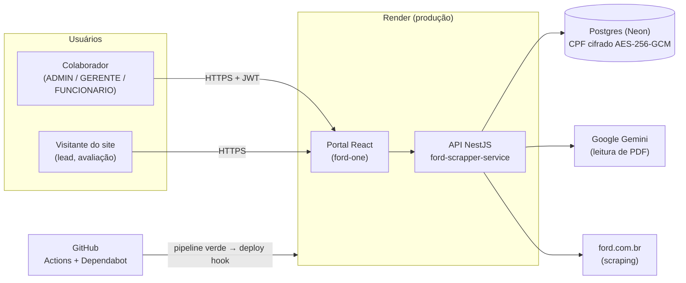
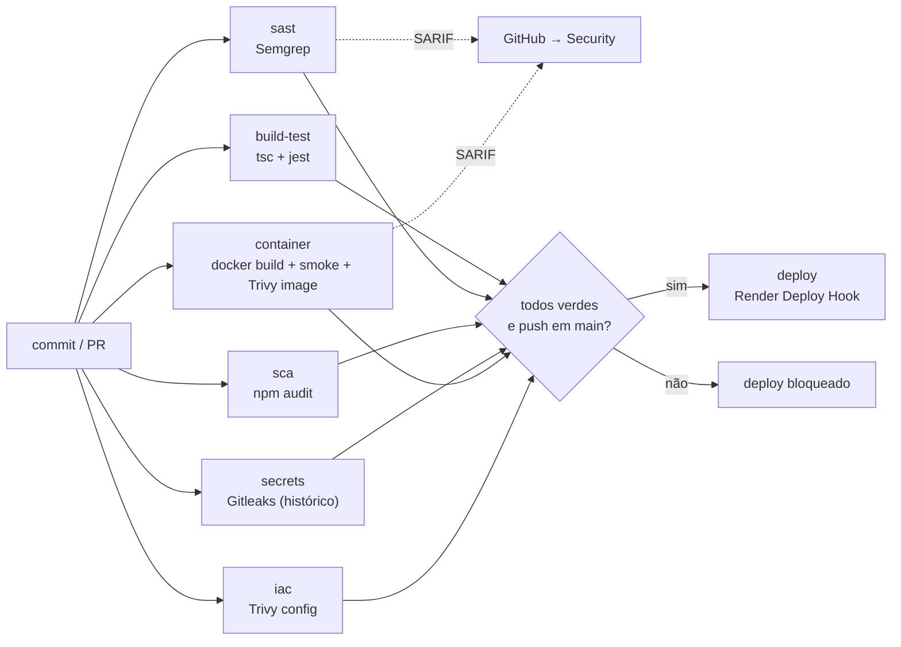
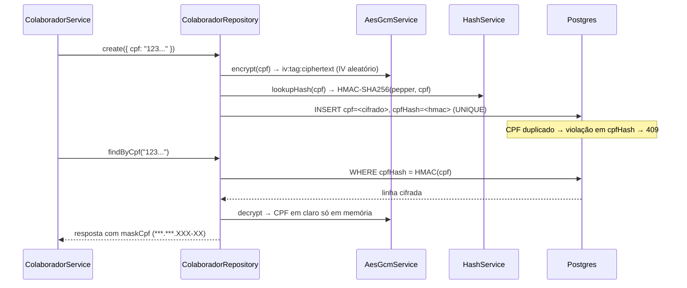
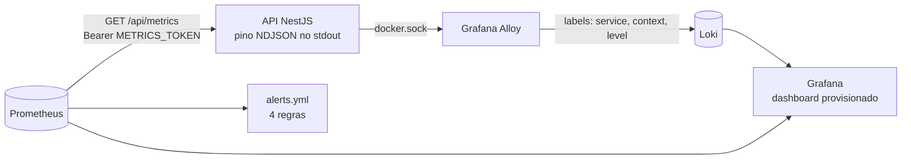
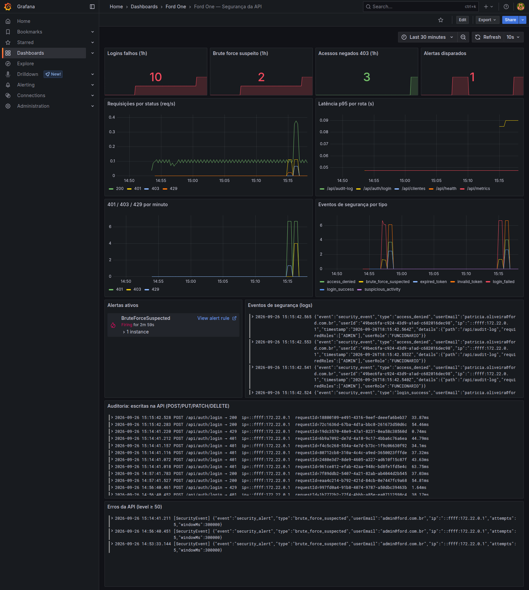
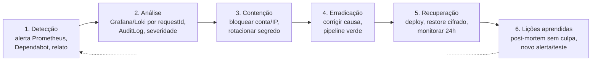

# Cybersecurity — Sprint 3: DevSecOps, Observabilidade e Compliance

> **Disciplina:** Cybersecurity · **Sprint 3** — 2º semestre 2026
> **Parceiro:** Ford do Brasil · **Projeto:** Ford One (`ford-scrapper-service` + portal web)
> **Documento anterior (Sprint 2):** [`CYBERSECURITY.md`](CYBERSECURITY.md) — controles de API que esta sprint reaproveita.

| Nome | RM |
| --- | --- |
| Ricardo Fernandes | 554597 |
| Khadija Lima | 558971 |
| Isadora Meneghetti | 556326 |
| Henrique Azevedo | 556707 |
| Gustavo Jun | 554718 |

**Sumário**

0. [Visão geral e escopo](#0-visão-geral-e-escopo)
1. [Atividade 1 — Pipeline DevSecOps](#1-atividade-1--pipeline-devsecops)
2. [Atividade 2 — Segurança em código e infraestrutura](#2-atividade-2--segurança-em-código-e-infraestrutura)
3. [Atividade 3 — Observabilidade, monitoramento e resposta a incidentes](#3-atividade-3--observabilidade-monitoramento-e-resposta-a-incidentes)
4. [Atividade 4 — Compliance, riscos e segurança contínua](#4-atividade-4--compliance-riscos-e-segurança-contínua)
5. [Checklist de conformidade](#5-checklist-de-conformidade)

Todas as evidências em texto e imagem estão em [`evidencias/sprint3-cyber/`](evidencias/sprint3-cyber/). Referências a código usam `arquivo:linha` relativo à raiz do repositório.

---

## 0. Visão geral e escopo

O Ford One é a plataforma de gestão de concessionária da Ford do Brasil: catálogo de veículos (coletado de ford.com.br e de PDFs de ficha técnica lidos pelo Gemini), CRM (clientes, leads, avaliações), estoque, financiamento, oficina (ordens de serviço, agendamentos, técnicos) e metas.

### Escopo desta entrega

| Componente | Status | Justificativa |
| --- | --- | --- |
| API REST (NestJS) | **No escopo** | Núcleo do produto; concentra autenticação, RBAC e dados pessoais. |
| Portal web (React) | **No escopo** | Cliente da API; recebe o JWT, não guarda dado sensível próprio. |
| Banco (Postgres) e backups | **No escopo** | Ativo de maior impacto (dados pessoais de clientes e CPF de colaboradores). |
| Pipeline CI/CD e infraestrutura (Docker, Render) | **No escopo** | É por onde o código chega à produção. |
| App mobile | **Não se aplica** | O produto não tem app. A seção [4.4](#44-owasp-mobile-top-10-2024--não-se-aplica) lista os controles previstos se um for criado. |
| IoT / MQTT | **Não se aplica** | Não há dispositivo conectado. A seção [2.6](#26-mqtt--tls-design-não-implementado) traz o desenho de segurança caso a oficina passe a integrar telemetria de veículos. |
| Modelos de ML próprios | **Não se aplica** | O único uso de IA é a chamada ao Gemini para extrair texto de PDF. Os riscos dessa integração estão no STRIDE ([4.1](#41-stride-revisado)). |

### Linha do tempo das mudanças (branch `feat/devsecops-sprint3`, PR #11)

| Commit | Atividade | O que entrou |
| --- | --- | --- |
| `a653454` | 1 | `npm audit` de 23 vulnerabilidades (1 crítica, 16 altas) para 0 |
| `6d0efee` | 2 | Dockerfile sem root, só dependências de produção, `HEALTHCHECK` |
| `5218d2b` · `b9434b4` · `d167e9e` | 1 | Pipeline DevSecOps, Dependabot, deploy só com pipeline verde, smoke test da imagem |
| `50f51f0` | 2 | CPF de colaborador cifrado (AES-256-GCM) com blind index (HMAC-SHA256) |
| `014bf16` | 2 | Backup do banco cifrado com GPG AES-256 |
| `e303cbf` · `b991db2` · `e5578d8` · `e656d56` | 3 | Métricas Prometheus, stack Loki/Alloy/Prometheus/Grafana, alertas, evidências |

---

## 1. Atividade 1 — Pipeline DevSecOps

### 1.1 Visão do pipeline

Arquivo: [`.github/workflows/devsecops.yml`](../.github/workflows/devsecops.yml). Roda em todo push e PR para `dev` e `main`, e manualmente (`workflow_dispatch`).

| Job | Ferramenta | Quebra o build quando | Risco que reduz |
| --- | --- | --- | --- |
| `build-test` | `npm ci`, `prisma generate`, `tsc --noEmit`, `npm test` (54 testes, incluindo testes HTTP de 401/403/429) | teste ou tipagem falhar | regressão em autenticação, RBAC e validação |
| `sast` | Semgrep 1.178 (`p/owasp-top-ten`, `p/nodejs`, `p/typescript`, `p/jwt`) | achado de severidade ERROR | injeção, JWT mal configurado, criptografia fraca no código |
| `sca` | `npm audit --omit=dev --audit-level=high` | dependência de produção com CVE alta ou crítica | biblioteca vulnerável (OWASP A06) |
| `secrets` | Gitleaks com `fetch-depth: 0` | segredo em qualquer commit do histórico | vazamento de chave, senha, token |
| `container` | `docker build`, smoke test (usuário ≠ root, sem `npm`) e Trivy image (CRITICAL/HIGH corrigíveis) | imagem vulnerável ou rodando como root | CVE no SO/base da imagem, escalada no container |
| `iac` | Trivy config em `Dockerfile`, `render.yaml` e compose | misconfiguração HIGH/CRITICAL | infraestrutura insegura por padrão |
| `deploy` | `needs:` todos os jobs acima, só em push para `main`; `curl` no deploy hook do Render | — | código não verificado chegar à produção |

**Do commit ao deploy.** O [`render.yaml`](../render.yaml) está com `autoDeploy: false`, então o Render não publica sozinho a cada push. O único caminho para produção é o job `deploy`, que só roda depois de todas as barreiras passarem.

### 1.2 Endurecimento do próprio pipeline

- **Actions fixadas por SHA** (`actions/checkout@11d5960…`), não por tag: uma tag sequestrada não muda o código executado.
- **Permissões mínimas:** o token do workflow é só leitura. Apenas os jobs que enviam SARIF recebem `security-events: write`.
- **Dependabot** ([`.github/dependabot.yml`](../.github/dependabot.yml)): npm, imagem Docker e GitHub Actions, semanal, com *cooldown* de 7 dias. Versões recém-publicadas esperam uma semana antes de virar PR, que é a janela em que pacotes comprometidos costumam ser detectados e despublicados.
- **Todo PR do Dependabot passa pelo mesmo pipeline:** uma atualização que introduza CVE ou quebre teste não é mesclada.

### 1.3 Evidências

| Evidência | Resultado |
| --- | --- |
| [`npm-audit-antes.txt`](evidencias/sprint3-cyber/npm-audit-antes.txt) | 23 vulnerabilidades (1 crítica, 16 altas, 5 moderadas, 1 baixa) |
| [`npm-audit-depois.txt`](evidencias/sprint3-cyber/npm-audit-depois.txt) | `found 0 vulnerabilities` |
| [`semgrep.txt`](evidencias/sprint3-cyber/semgrep.txt) | 113 regras em 233 arquivos: 0 achados |
| [`gitleaks.txt`](evidencias/sprint3-cyber/gitleaks.txt) | `no leaks found` no histórico completo |
| [`trivy-config.txt`](evidencias/sprint3-cyber/trivy-config.txt) | Dockerfile antes: 2 falhas (HIGH DS-0002 root, LOW DS-0026 sem healthcheck). Depois: 0 |
| Execução no GitHub Actions | run `36149111929`, todos os jobs verdes |
| `github-actions.png` *(print a anexar)* | Aba Actions com o pipeline verde |
| `github-security.png` *(print a anexar)* | Aba Security com os SARIF do Semgrep e do Trivy |

Correção do SCA: `npm audit fix` sem `--force`, alinhamento de todos os `@nestjs/*` em 11.2.6 e `overrides` no `package.json` para as dependências transitivas que o pacote pai ainda não havia corrigido.

---

## 2. Atividade 2 — Segurança em código e infraestrutura

### 2.1 Criptografia de dados sensíveis: CPF do colaborador

Antes, o CPF ficava em claro no banco (`String @unique`), só mascarado na resposta. Agora ele é gravado cifrado e a unicidade é garantida por um *blind index*.

| Controle | Evidência |
| --- | --- |
| Campo cifrado e índice único separado | `prisma/schema.prisma:106-111` |
| Gravação cifrada mais HMAC | `src/colaborador/infrastructure/repositories/colaborador.repository.ts:79-80` |
| Busca pelo hash, sem decifrar a tabela | `colaborador.repository.ts:56` |
| Decifragem centralizada no repositório | `colaborador.repository.ts:126` |
| Mascaramento na resposta | `src/colaborador/application/dto/colaborador-response.dto.ts:63,76` |
| Migração de dados existentes: backfill idempotente no boot (`cpfHash IS NULL`) | `src/colaborador/infrastructure/colaborador-cpf.backfill.ts:30-38` |
| Boot aborta em produção sem chave e pepper | `src/main.ts:80-83` |
| Teste de gravação cifrada | `colaborador.repository.spec.ts` |

**Por que AES-256-GCM e HMAC:** o GCM autentica o texto cifrado, então uma adulteração no banco é detectada ao decifrar. O IV aleatório faz dois CPFs iguais gerarem textos cifrados diferentes, o que impede comparação direta. Por isso a busca usa o HMAC com *pepper*: é determinístico (permite `UNIQUE` e busca), mas sem o pepper não dá para montar uma tabela dos ~10⁹ CPFs possíveis.

### 2.2 Backup cifrado

[`scripts/backup-db.sh`](../scripts/backup-db.sh): `pg_dump | gzip | gpg --symmetric --cipher-algo AES256`, gerando `ford_AAAAMMDD_HHMMSS.sql.gz.gpg`.

- O script **recusa rodar sem `BACKUP_PASSPHRASE`** (`backup-db.sh:33-34`): nenhum backup sai em claro.
- O [`restore-db.sh`](../scripts/restore-db.sh) faz o caminho inverso e pede confirmação antes de apagar o schema.
- Retenção de 14 dias, com execução diária via cron (ver [`OPERACAO.md`](OPERACAO.md)).
- Evidência: [`backup-cifrado.txt`](evidencias/sprint3-cyber/backup-cifrado.txt), com recusa sem passphrase, backup, arquivo ilegível, restore íntegro e falha com passphrase errada.

### 2.3 Hardening do container ([`Dockerfile`](../Dockerfile))

| Controle | Efeito |
| --- | --- |
| Build multi-stage; runtime com `npm ci --omit=dev` | jest, eslint e ts-jest ficam fora da imagem final |
| `npm`, `npx` e `corepack` removidos da imagem | eram a origem de todos os CVEs que o Trivy apontava na imagem |
| Arquivos com `--chown=node:node` e `USER node` | uma RCE na API não vira root no container |
| `HEALTHCHECK` em `/api/health` | o orquestrador reinicia a instância travada |
| Smoke test no CI (`id -u != 0`, prisma presente, sem npm) | garante que os pontos acima continuam valendo |

### 2.4 Hardening da API (Sprint 2, revalidado)

| Controle | Evidência |
| --- | --- |
| Helmet (HSTS, X-Content-Type-Options, frameguard...) | `src/main.ts:41` |
| Limite de corpo de 100 kB | `src/main.ts:37-38` |
| CORS por allow-list; `*` proibido em produção | `src/main.ts:47-57` |
| `JWT_SECRET` fraco ou de exemplo aborta o boot | `src/main.ts:62-70` |
| `ValidationPipe` com `whitelist` e `forbidNonWhitelisted` (bloqueia mass assignment) | `src/main.ts:100` |
| Erros padronizados, sem stack trace para o cliente | `src/main.ts:108`, `src/common/filters/http-exception.filter.ts:55-65` |
| JWT HS256 com expiração verificada | `src/auth/auth.module.ts:26-31`, `src/auth/infrastructure/strategies/jwt.strategy.ts:20` |
| Senhas com argon2id | `src/auth/application/auth.service.ts:47` |
| Rate limit global de 60/min e login a 5/min | `src/app.module.ts:65`, `src/auth/presentation/auth.controller.ts:46` |
| `JwtAuthGuard` global (rota pública só com `@Public`) | `src/app.module.ts:97-98` |
| Detecção de brute force (5 falhas por e-mail+IP em 5 min) | `src/common/security/security-event.logger.ts:22-23,86` |
| Redação de `authorization`, `cookie` e senhas nos logs | `src/app.module.ts:48-57` |

### 2.5 Controle de acesso por perfil (RBAC)

`RolesGuard` com `@Roles(...)` por rota. Resumo por módulo:

| Recurso | FUNCIONARIO | GERENTE | ADMIN |
| --- | --- | --- | --- |
| Clientes, leads, agendamentos, serviços, estoque (leitura e operação) | ✅ | ✅ | ✅ |
| Exclusões e operações gerenciais (estoque, financiamento, metas, técnicos, dashboards gerenciais) | ❌ | ✅ | ✅ |
| Colaboradores (listar e editar) | ❌ | ✅ | ✅ |
| Colaboradores (criar e desativar), sync do catálogo, configurações críticas | ❌ | ❌ | ✅ |
| Log de auditoria (`GET /audit-log`) | ❌ | ❌ | ✅ (`src/audit-log/presentation/audit-log.controller.ts`) |
| `GET /metrics` | token próprio (`METRICS_TOKEN`), fora do JWT | | |

Os testes HTTP (`src/http/api-http.spec.ts`) cobrem os casos de negação: FUNCIONARIO recebe 403 no DELETE de cliente, GERENTE recebe 403 no audit-log.

### 2.6 MQTT / TLS: design (não implementado)

O produto não tem dispositivos IoT. Se a oficina passar a receber telemetria de veículos (OBD) via MQTT, o broker deve seguir estes requisitos:

- **TLS 1.2+ obrigatório** (porta 8883; a 1883 fica fechada), com suítes AEAD.
- **mTLS por dispositivo:** cada veículo ou gateway tem certificado próprio emitido por uma CA interna, com revogação por CRL/OCSP. Sem `allow_anonymous`.
- **ACL por tópico:** o dispositivo só publica em `telemetria/{vin}/#` e não assina tópicos de outros; a API assina com credencial própria, só leitura.
- **Validação do payload** na API (schema), com limite de tamanho e rate limit por cliente no broker.
- **Eventos do broker** (conexão recusada, ACL negada) enviados ao mesmo Loki da seção 3.

### 2.7 Segurança de IaC

`Dockerfile`, `render.yaml` e os `docker-compose*.yml` são verificados pelo job `iac` (Trivy config). No `render.yaml`, os segredos são declarados com `sync: false`: o valor vive só no painel do Render, nunca no repositório. O deploy é manual via hook (`autoDeploy: false`).

---

## 3. Atividade 3 — Observabilidade, monitoramento e resposta a incidentes

### 3.1 Arquitetura

Tudo em [`observability/`](../observability/), com `docker compose up` e um único `.env` local.

- **Logs:** o pino já emitia JSON estruturado. O Alloy coleta o stdout do container e extrai `context` (HTTP, SecurityEvent...) e `level` como labels. Usamos o Alloy porque o Promtail chegou ao fim de suporte em março de 2026.
- **Métricas** (`src/common/metrics/metrics.service.ts`): `http_requests_total{method,route,status}`, `http_request_duration_seconds` e `security_events_total{type}`. A label `route` usa o padrão da rota (`/api/clientes/:id`), não a URL, para não explodir a cardinalidade.
- **Endpoint de métricas protegido** (`src/health/metrics.controller.ts`): exige `Bearer METRICS_TOKEN` com comparação em tempo constante e responde 404 se o token não estiver configurado. Métricas expõem rotas, volume e eventos de segurança, então não podem ficar abertas. Os testes cobrem 401, 401 com JWT de usuário, 200 e 404.

### 3.2 Dashboard e alertas

Dashboard **"Ford One — Segurança da API"** ([`ford-security.json`](../observability/grafana/dashboards/ford-security.json)): logins falhos, brute force, acessos 403, alertas disparados, requisições por status, latência p95 por rota, 401/403/429 por minuto, eventos de segurança por tipo, lista de alertas ativos, logs de eventos de segurança, trilha de escritas (POST/PUT/PATCH/DELETE) e erros.

| Alerta | Condição | Severidade |
| --- | --- | --- |
| `BruteForceSuspected` | `increase(security_events_total{type="brute_force_suspected"}[5m]) > 0` | crítica |
| `Unauthorized401Spike` | mais de 20 respostas 401 em 5 min | aviso |
| `HighServerErrorRate` | 5xx acima de 5% das requisições por 5 min | aviso |
| `ApiScrapeDown` | Prometheus sem coletar a API por 1 min | crítica |

| Evidência | O que mostra |
| --- | --- |
| [`observabilidade.txt`](evidencias/sprint3-cyber/observabilidade.txt) | Saída do gerador de tráfego, contadores, regras, alerta em firing, linhas no Loki e `authorization: [REDACTED]` no log |
| [`prometheus-alertas.png`](evidencias/sprint3-cyber/prometheus-alertas.png) | `BruteForceSuspected` FIRING; as outras 3 regras inativas |
| [`prometheus-targets.png`](evidencias/sprint3-cyber/prometheus-targets.png) | Alvo `ford-api` UP |
| [`grafana-alertas.png`](evidencias/sprint3-cyber/grafana-alertas.png) | As regras do Prometheus vistas no Grafana (1 firing, 3 normais) |

Reprodução: [`scripts/security-traffic.sh`](../scripts/security-traffic.sh) faz 5 logins falhos (dispara o brute force), um sexto que recebe 429, espera a janela do rate limit e gera logins válidos, 401 com token inválido e 403 de FUNCIONARIO no audit-log.

**Durante a validação**, o alerta de brute force não disparava: o contador só nascia no primeiro evento, e sem uma amostra anterior em 0 o `increase()` do Prometheus descarta esse evento. A correção (commit `e5578d8`) inicializa as séries em 0, e o teste de `/metrics` garante isso.

### 3.3 Plano de resposta a incidentes

**Papéis:** o dono do alerta é quem estiver de plantão no grupo (rodízio semanal). Decisões de rotação de segredo ou de restore precisam de dois integrantes. Incidentes com dado pessoal seguem também o fluxo LGPD da seção [4.5](#45-lgpd).

| Severidade | Exemplo | Tempo de resposta |
| --- | --- | --- |
| Crítica | segredo vazado, vazamento de banco, API fora | imediato (< 1 h) |
| Alta | brute force ativo, CVE crítica em produção | < 4 h |
| Média | pico de 401, 5xx elevado | < 1 dia útil |

#### Playbook A — Brute force (`BruteForceSuspected`)

1. **Analisar:** no Grafana, painel "Eventos de segurança (logs)". Filtrar `type=brute_force_suspected` e anotar e-mail alvo e IP. Conferir se houve `login_success` para o mesmo e-mail logo depois.
2. **Conter:** o throttle já devolve 429 após 5 tentativas por minuto. Se o ataque persistir, bloquear o IP no provedor (Render / WAF). Se houve login bem-sucedido suspeito, desativar o colaborador (`PATCH /colaboradores/:uuid` com `ativo=false`).
3. **Erradicar:** forçar troca de senha da conta alvo (runbook em `OPERACAO.md`).
4. **Recuperar e aprender:** reativar a conta com senha nova e avaliar se o limite de 5 tentativas continua adequado.

#### Playbook B — JWT ou `JWT_SECRET` vazado

1. **Conter:** gerar novo segredo (`openssl rand -base64 48`), atualizar `JWT_SECRET` no Render e fazer redeploy. Todos os tokens emitidos ficam inválidos na hora (HS256 com um único segredo).
2. **Analisar:** no `AuditLog`, listar as escritas feitas no período da exposição (`GET /audit-log`, ADMIN) e verificar ações fora do padrão.
3. **Erradicar:** achar a origem do vazamento (log, commit, máquina). Se foi commit, o Gitleaks deveria ter barrado: acrescentar a regra que faltou.
4. **Recuperar:** usuários fazem login de novo. Monitorar `invalid_token` no dashboard, que deve subir e depois zerar.

#### Playbook C — Dependência crítica (CVE)

1. **Detectar:** Dependabot abre PR ou alerta; o job `sca` fica vermelho em qualquer PR.
2. **Analisar:** a biblioteca vulnerável roda em produção (`--omit=dev`)? O caminho vulnerável é alcançável pela API?
3. **Conter e erradicar:** mesclar o PR do Dependabot ou aplicar `overrides`. O pipeline valida build, testes e Trivy.
4. **Recuperar:** deploy pelo pipeline. Se não houver correção disponível, registrar a exceção com justificativa e data de revisão neste documento.

#### Playbook D — Vazamento do banco ou do backup

1. **Conter:** trocar a senha do Postgres e a `DATABASE_URL`, e revogar o acesso de quem não precisa.
2. **Avaliar o impacto:** o CPF dos colaboradores está cifrado (AES-256-GCM) e só é legível com `DATA_ENCRYPTION_KEY`, que não fica no banco. Senhas estão em argon2id. Backups são `.gpg` e exigem `BACKUP_PASSPHRASE`. Nome, telefone e e-mail de clientes e leads estão em claro: tratar como dado pessoal exposto.
3. **Erradicar:** se houver suspeita de que a chave também vazou, rotacionar `DATA_ENCRYPTION_KEY` e o pepper e recifrar (o backfill por `cpfHash IS NULL` é reaproveitável para isso).
4. **Recuperar:** se os dados foram adulterados, restaurar o último backup íntegro com `restore-db.sh`.
5. **LGPD:** comunicar a ANPD e os titulares em até 3 dias úteis quando houver risco relevante (Resolução CD/ANPD nº 15/2024).

---

## 4. Atividade 4 — Compliance, riscos e segurança contínua

### 4.1 STRIDE revisado

| Componente | Ameaça (STRIDE) | Mitigação | Onde é verificada |
| --- | --- | --- | --- |
| **Portal React** | **S** roubo de token via XSS | JWT com expiração; React escapa saída; `stripXss` em texto livre na API | SAST (Semgrep) |
| | **I** credencial de demo no bundle | `VITE_DEMO_*` vazias por padrão; o build não embarca senha | Gitleaks |
| **API NestJS** | **S** brute force e credential stuffing | argon2id, throttle de 5/min, alerta de brute force | testes HTTP + alerta |
| | **T** mass assignment, injeção | `ValidationPipe` whitelist, Prisma parametrizado | testes + Semgrep |
| | **R** negar uma alteração feita | `AuditInterceptor` grava toda escrita (usuário, IP, recurso) | painel de auditoria |
| | **I** stack trace ou PII em log | `HttpExceptionFilter`, redact do pino | evidência `observabilidade.txt` |
| | **D** flood de requisições | rate limit global de 60/min, body de 100 kB | teste de 429 |
| | **E** FUNCIONARIO acessar rota de ADMIN | `JwtAuthGuard` global e `RolesGuard` | testes HTTP (403) |
| **Postgres / backup** | **I** dump ou backup vazado | CPF AES-256-GCM, senhas argon2id, backup GPG | spec do repositório + `backup-cifrado.txt` |
| | **T** adulteração do CPF cifrado | tag de autenticação do GCM (a decifragem lança erro) | revisão de código (`aes-gcm.service.ts`) |
| **Scraper / Gemini** | **T** resposta do Gemini ou página manipulada | URL base fixa (`ford-crawler.service.ts:9`), sem SSRF por entrada do usuário; JSON inválido é descartado; gravação via Prisma parametrizado | revisão de código (validação de schema pendente, ver 4.3 API10) |
| | **I** vazamento da `GEMINI_KEY` | chave só em env, `sync: false` no Render | Gitleaks |
| | **D** custo e abuso da sincronização | sync só para ADMIN/GERENTE, throttle de 1 a cada 5 min | teste de RBAC |
| **Pipeline CI/CD** | **T** action ou dependência comprometida | actions por SHA, cooldown de 7 dias, `npm ci` com lockfile | Dependabot + `sca` |
| | **E** token do workflow abusado | `permissions` mínimas por job | revisão do workflow |
| **Render (produção)** | **T** deploy de código não verificado | `autoDeploy: false`; deploy só pelo job gated | pipeline |
| | **E** RCE virar root | `USER node`, sem npm na imagem | smoke test e Trivy |

### 4.2 OWASP ASVS 4.0 (nível 1, com itens do nível 2 onde aplicável)

| Capítulo | Requisito (resumo) | Status | Evidência |
| --- | --- | --- | --- |
| V2 Autenticação | Senhas com hash resistente (2.4.1) | ✅ atende | argon2id, `auth.service.ts:47` |
| | Tamanho mínimo 8 e máximo sem truncar (2.1.1/2.1.2) | ✅ atende | `create-colaborador.dto.ts:65-66` (8–72, dentro do limite do argon2) |
| | Proteção contra automação (2.2.1) | ✅ atende | throttle de 5/min e alerta de brute force |
| | Checagem contra senhas vazadas (2.1.7) | ⚠️ parcial | não há consulta a base de senhas vazadas (melhoria prevista) |
| V3 Sessão | Token com expiração verificada (3.3.1) | ✅ atende | `jwt.strategy.ts:20` |
| | Revogação no logout (3.3.1 L2) | ⚠️ parcial | JWT stateless: revogação global por rotação de `JWT_SECRET` (playbook B) |
| V4 Acesso | Negar por padrão (4.1.3) | ✅ atende | `JwtAuthGuard` global, `app.module.ts:97-98` |
| | Menor privilégio por função (4.1.1) | ✅ atende | tabela RBAC 2.5 e testes 403 |
| V5 Validação | Allow-list de entrada (5.1.3) | ✅ atende | `ValidationPipe` whitelist, `main.ts:100` |
| | Consultas parametrizadas (5.3.4) | ✅ atende | Prisma ORM; Semgrep sem achados |
| V7 Logs | Logs sem credenciais nem dados sensíveis (7.1.1) | ✅ atende | redact do pino; `authorization: [REDACTED]` na evidência |
| | Eventos de segurança registrados (7.1.3/7.2.1) | ✅ atende | `SecurityEventLogger` (7 tipos) e AuditLog |
| | Erro genérico ao cliente (7.4.1) | ✅ atende | `HttpExceptionFilter` |
| V8 Proteção de dados | Dados sensíveis cifrados em repouso (8.3.x L2) | ✅ atende | CPF AES-256-GCM, backup GPG |
| | Dados pessoais de clientes | ⚠️ parcial | nome/telefone/e-mail em claro: necessários para busca e contato; protegidos por RBAC e auditoria |
| V9 Comunicação | TLS em todo tráfego externo (9.1.1) | ✅ atende | Render e Neon só com HTTPS/TLS; HSTS via Helmet |
| V14 Configuração | Build e deploy automatizados e verificados (14.1.1) | ✅ atende | pipeline da seção 1 |
| | Dependências sem vulnerabilidades conhecidas (14.2.1) | ✅ atende | `sca` e Dependabot |
| | Cabeçalhos de segurança (14.4) | ✅ atende | Helmet (`main.ts:41`) |
| | Documentação de API não exposta sem necessidade (14.3.x) | ⚠️ parcial | Swagger em `/api/docs` ativo também em produção; plano: desligar ou proteger |

### 4.3 OWASP API Security Top 10 (2023)

| Risco | Mitigação | Evidência |
| --- | --- | --- |
| API1 BOLA | Todos os recursos exigem JWT. O modelo de negócio é por concessionária (sem dono por registro), com isolamento por perfil. IDs são UUID v4, não sequenciais | `JwtAuthGuard` global; `ParseUUIDPipe` em todo parâmetro de ID (11 controllers) |
| API2 Autenticação quebrada | argon2id, JWT HS256 com expiração, throttle e alerta de brute force, mensagem igual para e-mail inexistente e senha errada | `api-http.spec.ts` (teste "sem revelar que o e-mail não existe") |
| API3 Propriedade quebrada | `forbidNonWhitelisted` rejeita campo extra; DTOs de resposta sem senha e com CPF mascarado | `main.ts:100`, `colaborador-response.dto.ts:63` |
| API4 Consumo irrestrito | Rate limit global e por rota, body de 100 kB, paginação com `limit` ≤ 100 | `app.module.ts:65`, `main.ts:37`, `pagination.dto.ts:17-18` |
| API5 Autorização de função | `RolesGuard` com `@Roles` por rota | tabela 2.5 e testes 403 |
| API6 Fluxos sensíveis | Lead e avaliação públicos com throttle de 3/min; sync do catálogo com 1 a cada 5 min | `public-lead.controller.ts:15`, `scrapper.controller.ts:27` |
| API7 SSRF | O scraper só acessa a URL base fixa; nenhuma URL vem do usuário | `ford-crawler.service.ts:9` |
| API8 Misconfiguração | Helmet, CORS por allow-list, boot aborta com config insegura, IaC no pipeline | `main.ts:41-83`, job `iac` |
| API9 Inventário | Swagger versionado, contratos em `docs/INTEGRATION-CONTRACTS.md`, prefixo único `/api` | `main.ts:31` |
| API10 Consumo inseguro de APIs | ⚠️ parcial. A resposta do Gemini só passa por `JSON.parse`; se vier inválida, é descartada e registrada em log, e o sync é assíncrono, fora do fluxo do usuário. Falta validar o schema dos campos e colocar timeout na chamada | `gemini-reader.service.ts:175-185` |

### 4.4 OWASP Mobile Top 10 (2024) — não se aplica

O Ford One não tem aplicativo móvel: o portal é web responsivo. Se um app for criado, os requisitos mínimos são:

| Risco | Controle previsto |
| --- | --- |
| M1 Uso indevido de credenciais | Nenhuma chave de API no app; tudo via API autenticada |
| M3 Autenticação insegura | Mesmo JWT da API, token em Keychain/Keystore, nunca em armazenamento comum |
| M5 Comunicação insegura | TLS 1.2+ com certificate pinning |
| M8 Misconfiguração | `android:debuggable=false`, sem backup automático dos dados do app |
| M9 Armazenamento inseguro | Nada de PII em cache local; limpeza no logout |
| M7 Proteção de binário | Ofuscação (R8/ProGuard) e detecção de root/jailbreak nas telas sensíveis |
| M2 Supply chain | Mesmo pipeline (SCA, SAST, secret scan) aplicado ao repositório mobile |

### 4.5 LGPD

**Inventário de dados pessoais**

| Dado | Titular | Onde | Finalidade | Base legal (art. 7º) | Proteção |
| --- | --- | --- | --- | --- | --- |
| Nome, telefone, e-mail | Cliente | `Cliente` | atendimento, venda, pós-venda | execução de contrato / procedimentos preliminares (V) | RBAC, auditoria de escrita, TLS |
| Nome, telefone, e-mail | Interessado | `Lead` | retorno comercial solicitado pelo titular | procedimentos preliminares a pedido do titular (V) | idem; throttle no formulário público |
| Nome do cliente | Cliente | `Financiamento` | simulação e proposta | execução de contrato (V) | idem |
| CPF | Colaborador | `Colaborador.cpf` | identificação funcional | obrigação legal/trabalhista (II) | **AES-256-GCM** mais blind index; mascarado na API |
| Senha | Colaborador | `Colaborador.senha` | autenticação | execução de contrato (V) | argon2id; nunca retornada |
| E-mail, IP, user-agent | Colaborador | `AuditLog` | segurança e rastreabilidade | legítimo interesse / segurança (IX) | só ADMIN lê; redact de credenciais |
| Telemetria / geolocalização | — | — | — | **não se aplica**: o produto não coleta | — |

**Princípios e medidas**

- **Minimização:** o formulário público de lead pede nome, e-mail, telefone, veículo de interesse e mensagem, o mínimo para o retorno comercial. O CPF de cliente não é coletado. Logs HTTP não guardam corpo de requisição.
- **Segurança (art. 46):** criptografia em repouso (CPF e backup), em trânsito (TLS), controle de acesso por perfil, trilha de auditoria e monitoramento com alertas.
- **Retenção:** backups por 14 dias. Para clientes e leads inativos há 2 anos, está prevista a anonimização por pseudônimo (`HashService.pseudonymize`), conforme o Índice C do documento da Sprint 2.
- **Direitos do titular (art. 18):** acesso e correção pelos endpoints de cliente/lead (GERENTE/ADMIN). A eliminação é feita por DELETE com registro no AuditLog. Solicitações chegam pelo canal da concessionária e são atendidas em até 15 dias.
- **Incidentes (art. 48):** Playbook D, com comunicação à ANPD e aos titulares.

### 4.6 Plano de segurança contínua

| Frequência | Atividade | Responsável | Registro |
| --- | --- | --- | --- |
| Todo PR e push | Pipeline DevSecOps completo (seção 1) | automático | GitHub Actions / Security |
| Semanal | PRs do Dependabot (npm, Docker, Actions), revisados e mesclados com pipeline verde | plantão | PRs |
| Diário | Backup cifrado (cron 03:00), retenção de 14 dias | automático | `backup.log` |
| Contínuo | Alertas do Prometheus (brute force, 401, 5xx, API fora) | plantão | Grafana |
| Mensal | **Auditoria de permissões:** colaboradores ativos por perfil e escritas dos 30 dias no AuditLog (queries em [`OPERACAO.md`](OPERACAO.md)) | ADMIN | ata da revisão |
| Mensal | **Teste de restore** do backup em banco descartável | ADMIN | evidência como `backup-cifrado.txt` |
| Trimestral | Revisão deste documento (STRIDE, ASVS, exceções) e rotação de `METRICS_TOKEN` | grupo | commit no documento |
| Anual ou em incidente | Rotação de `JWT_SECRET` e das chaves de criptografia (recifrando) | ADMIN | Playbook B / D |

---

## 5. Checklist de conformidade

| # | Item | Status |
| --- | --- | --- |
| 1 | Pipeline com SAST, SCA, secret scan, scan de imagem e de IaC | ✅ |
| 2 | Build quebra em vulnerabilidade high/critical | ✅ |
| 3 | Deploy só depois do pipeline verde | ✅ |
| 4 | Dependências atualizadas automaticamente (Dependabot) | ✅ |
| 5 | Zero vulnerabilidades high/critical em dependências de produção | ✅ |
| 6 | Container sem root e sem ferramentas de build | ✅ |
| 7 | Dados sensíveis cifrados em repouso (CPF) | ✅ |
| 8 | Backup cifrado com restore testado | ✅ |
| 9 | Autenticação forte (argon2id, JWT com expiração, anti brute force) | ✅ |
| 10 | Controle de acesso por perfil testado | ✅ |
| 11 | Logs estruturados sem credenciais | ✅ |
| 12 | Métricas e dashboard de segurança | ✅ |
| 13 | Alertas automáticos (brute force, 401, 5xx, indisponibilidade) | ✅ |
| 14 | Plano de resposta a incidentes com playbooks | ✅ |
| 15 | STRIDE, ASVS, API Top 10 revisados | ✅ |
| 16 | Inventário LGPD com base legal | ✅ |
| 17 | Checagem de senha vazada | ⬜ planejado |
| 18 | Swagger protegido ou desligado em produção | ⬜ planejado |
| 19 | Anonimização automática por retenção (cron LGPD) | ⬜ planejado |
| 20 | Validação de schema e timeout na resposta do Gemini (API10) | ⬜ planejado |
| 21 | Alertas enviados para fora do Grafana (Alertmanager → e-mail/Slack) | ⬜ planejado |

**Configuração pendente em produção (Render):** `DATA_ENCRYPTION_KEY`, `DATA_ENCRYPTION_PEPPER`, `METRICS_TOKEN` e o secret `RENDER_DEPLOY_HOOK` no GitHub; secret scanning e Dependabot alerts ativados nas settings do repositório.
