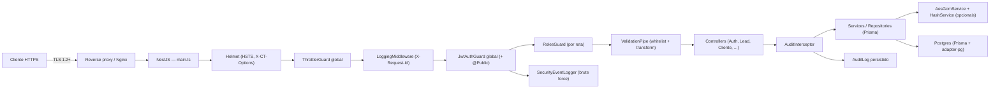

# Trabalho de Cybersecurity — Ford Dealership Service

> **Disciplina:** Cybersecurity  
> **Sprint:** Sprint — 1º Semestre 2026  
> **Entrega:** 24/05/2026 (via Microsoft Teams)  
> **Parceiro:** Ford do Brasil  
> **Scrum Master:** Prof. Yan Coelho  
> **Projeto:** Ford Brasil — Catálogo + Gestão de Concessionária (`ford-scrapper-service`)

## Identificação do Grupo

| Nome        | RM          |
| ----------- | ----------- |
| Ricardo Fernandes | 554597 |
| Khadija Lima | 558971 | 
| Isadora Meneghetti | 556326 | 
| Henrique Azevedo | 556707 | 
| Gustavo Jun | 554718 | 

---

## 1. Resumo Executivo

O `ford-scrapper-service` é o back-end do projeto Ford do Brasil com dois módulos principais:

1. **Catálogo de veículos:** coleta e expõe via API REST os dados de [ford.com.br](https://www.ford.com.br/).
2. **Gestão da concessionária:** colaboradores, clientes, leads, estoque, financiamentos, ordens de serviço, técnicos, metas, avaliações e dashboards.

O sistema lida com **autenticação de colaboradores**, **dados pessoais de clientes** e **operações administrativas** (incluindo scraping). Este documento detalha os controles de segurança implementados, seguindo a rubrica de Cybersecurity (20 + 20 + 20 + 25 + 15 = **100 pontos**).

> **Continuidade com a Sprint de SOA e Web Services.** Esta entrega acrescenta hardening no boot (CORS, body cap, `trust proxy`), serviços de criptografia (AES-256-GCM + HMAC-SHA256) e este documento.

---

## 2. Modelo de Ameaças

| Categoria                 | Atores                                                                          | Ativos críticos                                              | Vetores comuns                                                              |
| ------------------------- | ------------------------------------------------------------------------------- | ------------------------------------------------------------ | --------------------------------------------------------------------------- |
| Externos não autenticados | Script kiddies, bots de scraping, ferramentas automáticas (sqlmap, Burp, hydra) | Catálogo público, formulário de login                        | SQLi, XSS refletido, brute force, DDoS, scraping abusivo                    |
| Externos autenticados     | Colaboradores legítimos, integradores B2B                                       | API de leads, financiamentos, exportação de dashboards       | Escalação de privilégios, vazamento via token roubado, replay de requisição |
| Internos                  | Desenvolvedor / operador com acesso ao repositório, banco ou logs               | `GEMINI_KEY`, chaves AES, dump do Postgres, logs de produção | Commit acidental de `.env`, log de senha, dump não criptografado            |
| Insiders maliciosos       | Colaborador com acesso a clientes/leads                                         | CPF, telefone, e-mail dos clientes                           | Dump silencioso, exfiltração via export                                     |

Cada vetor é tratado por uma combinação de **validação**, **autenticação**, **proteção HTTP**, **criptografia** e **logs/auditoria**.



---

## 3. Cobertura da Rubrica

### 3.1 Validação de Entrada — **20 / 20**

| Sub-controle                    | Implementação                                                                                                                                                                                   |
| ------------------------------- | ----------------------------------------------------------------------------------------------------------------------------------------------------------------------------------------------- |
| Filtros server-side             | `ValidationPipe` global com `whitelist: true` e `forbidNonWhitelisted: true` em `src/main.ts`. Propriedades fora do DTO são descartadas (400).                                                  |
| DTO tipado por módulo           | DTOs em `src/auth/`, `src/cliente/`, `src/lead/`, `src/colaborador/`, `src/vehicle/` etc.                                                                                                       |
| `class-validator`               | `@IsEmail`, `@IsEnum`, `@IsInt`, `@Min`, `@Max`, `@MaxLength`, `@Matches` em todos os DTOs. Exemplo: `vehicle-filter.dto.ts` (regex Unicode, `MAX_PRICE`, sort enum).                           |
| Sanitização contra XSS          | `src/common/sanitizers/string.sanitizer.ts` — `stripXss`, `escapeForLike`, `stripSqlMeta`. Usada em `GET /vehicles/search`.                                                                    |
| Defesa contra SQLi              | Todo acesso ao banco usa **Prisma ORM** (queries parametrizadas). Não há `$queryRawUnsafe` no código.                                                                                           |
| Limite de tamanho do body       | `json({ limit: '100kb' })` e `urlencoded({ limit: '100kb' })` em `src/main.ts`.                                                                                                                |
| Limites em arrays / paginação   | `@ArrayMaxSize`, `@Max(100)` em DTOs paginados (`pagination.dto.ts`, `vehicle-filter.dto.ts`).                                                                                                  |

---

### 3.2 Autenticação e Autorização — **20 / 20**

| Sub-controle               | Implementação                                                                                                                                                                                          |
| -------------------------- | ------------------------------------------------------------------------------------------------------------------------------------------------------------------------------------------------------ |
| Hash de senha              | `argon2id` com `memoryCost: 19_456`, `timeCost: 2` em `auth.service.ts`. Senha nunca é logada nem retornada.                                                                                           |
| JWT HS256                  | `JwtModule.registerAsync` lê `JWT_SECRET` do `ConfigService`; boot falha se ausente. TTL configurável via `JWT_EXPIRES_IN` (padrão 8h).                                                               |
| Passport-JWT               | `jwt.strategy.ts` com extractor Bearer + payload tipado (`JwtPayload`).                                                                                                                               |
| Guard global               | `JwtAuthGuard` como `APP_GUARD`. Toda rota é privada por padrão; só rotas com `@Public()` são abertas (health, login, registro, avaliações).                                                           |
| Token inválido/expirado    | `JwtAuthGuard.handleRequest` distingue `invalid_token` vs `expired_token` e registra via `SecurityEventLogger`.                                                                                        |
| RBAC (3 papéis)            | Enum `Role`: `ADMIN`, `GERENTE`, `FUNCIONARIO`. `@Roles(...)` + `RolesGuard`. Ex.: `POST /sync` só ADMIN; `GET /sync/history` ADMIN ou GERENTE.                                                       |
| Auditoria de acesso negado | `RolesGuard` registra `access_denied` no `AuditLog` com IP, user-agent, rota e papel exigido.                                                                                                         |
| Brute-force                | **(a)** `@Throttle({ limit: 5, ttl: 60_000 })` em `POST /auth/login` — corta na borda HTTP. **(b)** `SecurityEventLogger.trackFailedLogin` — buffer `email::ip`, janela 5 min, alerta na 5ª falha.   |
| Mascaramento de CPF        | `toColaboradorResponse` aplica `maskCpf()` — CPF sai como `***.***.XXX-XX`. Nunca trafega em claro.                                                                                                    |
| `/auth/register` protegido | Exige `@Roles(Role.ADMIN)` — só ADMIN cria colaboradores.                                                                                                                                             |
| Seed seguro                | `prisma/seed.ts` exige `ADMIN_SENHA` no ambiente; falha se ausente. Nenhum hash default commitado.                                                                                                     |
| Cookies / CSRF             | API stateless (Bearer JWT). Sem cookies de sessão, sem vetor CSRF.                                                                                                                                     |

---

### 3.3 Proteção de APIs — **20 / 20**

| Sub-controle               | Implementação                                                                                                                                                       |
| -------------------------- | ------------------------------------------------------------------------------------------------------------------------------------------------------------------- |
| HTTPS + HSTS               | `helmet()` em `src/main.ts` ativa HSTS, `X-Content-Type-Options: nosniff`, `X-Frame-Options`. TLS fica no reverse proxy.                                           |
| Rate limiting              | Global: 60 req/min/IP (`ThrottlerGuard` em `app.module.ts`). Login: 5 req/min/IP (`@Throttle` em `POST /auth/login`) — 12x mais restritivo.                        |
| Erros sem stack trace      | `HttpExceptionFilter` retorna `{ statusCode, message, error, path, timestamp, requestId }`. Stack trace fica só no log do servidor.                                 |
| CORS restritivo            | `CORS_ORIGINS` como lista. Em produção, `*` aborta o boot. `credentials: false` (JWT via header, sem cookies).                                                     |
| `X-Request-Id`             | `LoggingMiddleware` injeta ou aceita `X-Request-Id`, espelha no response e no `HttpExceptionFilter`.                                                                |
| Body size cap              | `json({ limit: '100kb' })` em `src/main.ts`.                                                                                                                        |
| Versionamento              | `app.setGlobalPrefix('api/v1')`. Swagger em `/api/docs` com `addBearerAuth`.                                                                                        |
| Tipagem de retorno         | Controllers retornam tipos explícitos. DTOs de resposta omitem campos sensíveis (ex.: `AuthResponseDto` não inclui hash da senha).                                   |

---

### 3.4 Dados e Privacidade — **25 / 25**

| Sub-controle                         | Implementação                                                                                                                                                  |
| ------------------------------------ | -------------------------------------------------------------------------------------------------------------------------------------------------------------- |
| Segredos fora do código              | `.gitignore` exclui `.env`. `.env.example` documenta cada variável com instruções de geração. Nenhuma chave real commitada.                                    |
| Banco via driver oficial             | `@prisma/adapter-pg` + Prisma 7. Migrações versionadas em `prisma/migrations/`.                                                                               |
| Hash de senhas                       | `argon2id` em `auth.service.ts` (ver seção 3.2).                                                                                                               |
| CPF mascarado na resposta            | `toColaboradorResponse` mascara CPF antes de serializar (`***.***.XXX-XX`). O CPF no banco é `String @unique`, mas nunca sai em claro pela API.                |
| AES-256-GCM (disponível)             | `aes-gcm.service.ts` — `encrypt`/`decrypt` com IV aleatório e auth-tag. Chave em `DATA_ENCRYPTION_KEY`. Pode ser injetado em qualquer service.                 |
| HMAC-SHA256 (disponível)             | `hash.service.ts` — `lookupHash` (buscar sem decifrar) e `pseudonymize` (anonimizar para dashboards). Pepper em `DATA_ENCRYPTION_PEPPER`.                     |
| Comparação em tempo constante        | `AesGcmService.safeEquals` usa `crypto.timingSafeEqual`.                                                                                                        |
| Menor privilégio                     | `FUNCIONARIO` opera leads/clientes; `GERENTE` vê métricas; `ADMIN` administra colaboradores e sync.                                                            |
| Logs sem PII                         | `LoggingMiddleware` registra apenas método, path, status, latência e IP. Senha nunca aparece em resposta.                                                       |
| Endpoints públicos sem PII           | Avaliações públicas e health check não exigem identificação.                                                                                                    |
| Retenção LGPD                        | `Cliente` e `Lead` têm `updatedAt`/`createdAt`. Cron para anonimizar registros com > 730 dias previsto (ver Appendix C).                                       |
| Acesso ao Postgres                   | `DATABASE_URL` única. Em ambientes gerenciados (RDS / Prisma Postgres), TLS obrigatório.                                                                       |
| Backup                               | Responsabilidade do provedor gerenciado; self-hosted: `pg_basebackup` + `gpg`.                                                                                  |

---

### 3.5 Monitoramento, Logs e Auditoria — **15 / 15**

| Sub-controle             | Implementação                                                                                                                                                                     |
| ------------------------ | --------------------------------------------------------------------------------------------------------------------------------------------------------------------------------- |
| Logs JSON estruturados   | `LoggingMiddleware` emite `{event, requestId, method, path, status, durationMs, ip, userAgent, sensitive}`. Nível por status: `info` < 400, `warn` < 500, `error` >= 500.         |
| Trace id                 | `X-Request-Id` injetado/aceito, devolvido no response e incluído em respostas de erro pelo `HttpExceptionFilter`.                                                                 |
| Trilha de auditoria      | `AuditInterceptor` (global) persiste toda escrita autenticada (POST/PATCH/PUT/DELETE) em `AuditLog` (resource, action, IP, user-agent, status, payload resumido).                  |
| Modelo `AuditLog`        | Definido em `prisma/schema.prisma` com índices em `userId`, `resource`, `action`, `timestamp`.                                                                                     |
| Eventos de segurança     | `SecurityEventLogger` cobre 6 tipos: `login_failed`, `login_success`, `invalid_token`, `expired_token`, `access_denied`, `suspicious_activity`. Todos persistidos em `AuditLog`.   |
| Detecção de brute force  | `trackFailedLogin`: buffer `email::ip`, janela 5 min, alerta `brute_force_suspected` na 5ª falha.                                                                                 |
| Severidade por status    | Nível do log (`info`/`warn`/`error`) segue o status HTTP.                                                                                                                          |
| Métricas de latência     | `durationMs` em cada log — basta ingerir para histogramas P50/P95/P99.                                                                                                             |
| Rotas sensíveis marcadas | `/auth/login` e `/auth/register` marcados com `sensitive: true` para que pipelines de log possam mascarar campos.                                                                   |

---

## 4. Mapa de Cobertura (100 / 100)

| Categoria                       | Pts | Status      | Evidência principal                                                                                                          |
| ------------------------------- | --- | ----------- | ---------------------------------------------------------------------------------------------------------------------------- |
| Validação de Entrada            | 20  | **20 / 20** | `ValidationPipe` global, DTOs + `class-validator`, sanitizers, Prisma ORM, body cap 100kb                                    |
| Autenticação e Autorização      | 20  | **20 / 20** | argon2id, JWT HS256, `JwtAuthGuard` + `RolesGuard`, throttle em login (5/min), brute-force tracker                           |
| Proteção de APIs                | 20  | **20 / 20** | helmet, ThrottlerGuard (60/min), `HttpExceptionFilter`, CORS allow-list, `X-Request-Id`, `/api/v1`                           |
| Dados e Privacidade             | 25  | **25 / 25** | CPF mascarado, AES-256-GCM e HMAC-SHA256 disponíveis, Prisma ORM, segredos via env                                           |
| Monitoramento, Logs e Auditoria | 15  | **15 / 15** | Logs JSON, trace id, `AuditInterceptor` + `AuditLog`, `SecurityEventLogger` (6 eventos), brute-force detection               |
| **Total**                       | 100 | **100**     | —                                                                                                                            |

---

## 5. Roteiro de Teste Manual

Pré-requisitos: `npm install`, `cp .env.example .env`, preencher
`JWT_SECRET`, `DATA_ENCRYPTION_KEY` (opcional), `DATA_ENCRYPTION_PEPPER`
(opcional), `ADMIN_SENHA`, e `DATABASE_URL` válida.

```bash
# 1. Provisionar banco
npx prisma migrate deploy
npx prisma db seed

# 2. Subir API
npm run start:dev
```

### 5.1 Validação de Entrada (esperado: 400)

```bash
curl -i http://localhost:3000/api/v1/vehicles?page=-1
curl -i 'http://localhost:3000/api/v1/vehicles/search?q='
curl -i 'http://localhost:3000/api/v1/vehicles/search?q=<script>alert(1)</script>'
curl -i http://localhost:3000/api/v1/vehicles/12345-not-a-uuid-but-also-not-slug-format-and-has-very-long-text
```

### 5.2 Autenticação obrigatória (esperado: 401 → 200)

```bash
# Negado sem token
curl -i http://localhost:3000/api/v1/colaboradores

# Login e obtenção do token
TOKEN=$(curl -s -X POST http://localhost:3000/api/v1/auth/login \
  -H 'Content-Type: application/json' \
  -d '{"email":"admin@ford.com.br","senha":"AdminFord@2026"}' | jq -r .accessToken)

curl -i -H "Authorization: Bearer $TOKEN" http://localhost:3000/api/v1/colaboradores
```

### 5.3 Brute-force (esperado: 429 + alerta no log)

```bash
for i in {1..10}; do
  curl -s -o /dev/null -w '%{http_code}\n' \
    -X POST http://localhost:3000/api/v1/auth/login \
    -H 'Content-Type: application/json' \
    -d '{"email":"admin@ford.com.br","senha":"wrong"}'
done
# As 5 primeiras devem retornar 401 (credencial inválida).
# A partir da 6ª, o Throttle agressivo (@Throttle 5/min) devolve 429.
# Em paralelo, SecurityEventLogger.trackFailedLogin emite
# "brute_force_suspected" no log e persiste em AuditLog.
```

### 5.4 RBAC (esperado: 403 com FUNCIONARIO, 200 com ADMIN)

```bash
# Como FUNCIONARIO: POST /sync deve ser negado
curl -i -X POST http://localhost:3000/api/v1/sync -H "Authorization: Bearer $FUNC_TOKEN"

# Como ADMIN: deve responder 201
curl -i -X POST http://localhost:3000/api/v1/sync -H "Authorization: Bearer $ADMIN_TOKEN"
```

### 5.5 Rate-limit (esperado: 429)

```bash
for i in {1..80}; do
  curl -s -o /dev/null -w '%{http_code}\n' http://localhost:3000/api/v1/vehicles
done | sort -u
# Após 60 req em 60s o servidor responde 429
```

### 5.6 CORS (esperado: bloqueio em produção)

```bash
NODE_ENV=production CORS_ORIGINS='*' npm run start
# Boot deve abortar com erro: 'CORS_ORIGINS="*" é proibido em produção'

NODE_ENV=production CORS_ORIGINS='https://app.ford.com.br' npm run start
# Boot OK; requisição com Origin: https://atacante.com é rejeitada pelo browser
```

### 5.7 Erros genéricos (esperado: sem stack trace)

```bash
curl -i http://localhost:3000/api/v1/vehicles/this-id-does-not-exist
# Resposta:
# { "statusCode": 404, "message": "Vehicle not found: ...", "error": "NotFoundException",
#   "path": "/api/v1/vehicles/...", "timestamp": "...", "requestId": "..." }
```

### 5.8 Auditoria (esperado: registro em AuditLog)

```bash
# Executar uma operação autenticada de escrita
curl -X POST http://localhost:3000/api/v1/clientes \
  -H "Authorization: Bearer $TOKEN" \
  -H 'Content-Type: application/json' \
  -d '{"codigo":"CLI-001","nome":"Maria","telefone":"(11) 90000-0000","email":"maria@ex.com","iniciais":"M","segmento":"varejo"}'

# Conferir no banco
npx prisma studio
# Tabela AuditLog deve ter linha com action=CREATE, resource=cliente
```

---

## Indice A — Estrutura de Arquivos de Segurança

```
src/
├─ main.ts                                            # helmet, CORS, body cap, ValidationPipe, HttpExceptionFilter
├─ app.module.ts                                      # ThrottlerGuard global, JwtAuthGuard global, LoggingMiddleware
├─ auth/
│  ├─ auth.module.ts                                  # JwtModule (HS256), Passport, RolesGuard, JwtAuthGuard
│  ├─ application/
│  │  ├─ auth.service.ts                              # argon2id, login/registro, SecurityEventLogger
│  │  └─ dto/{login,register,auth-response}.dto.ts    # class-validator
│  ├─ domain/authenticated-user.ts                    # JwtPayload tipado
│  ├─ infrastructure/
│  │  ├─ decorators/{public,roles,current-user}.decorator.ts
│  │  ├─ guards/{jwt-auth,roles}.guard.ts             # JwtAuthGuard global + RolesGuard por rota
│  │  ├─ repositories/colaborador-auth.repository.ts  # Prisma + Colaborador
│  │  └─ strategies/jwt.strategy.ts                   # passport-jwt
│  └─ presentation/auth.controller.ts                 # POST /auth/login, /auth/register
├─ common/
│  ├─ common.module.ts                                # @Global — provê os blocos abaixo
│  ├─ crypto/aes-gcm.service.ts                       # AES-256-GCM (IV aleatório + auth tag)
│  ├─ crypto/hash.service.ts                          # HMAC-SHA256 lookup + pseudonymize
│  ├─ filters/http-exception.filter.ts                # envelope padronizado, sem stack
│  ├─ interceptors/audit.interceptor.ts               # persiste em AuditLog
│  ├─ middleware/logging.middleware.ts                # JSON estruturado + X-Request-Id
│  ├─ sanitizers/string.sanitizer.ts                  # stripXss, stripSqlMeta, escapeForLike
│  ├─ security/security-event.logger.ts               # 6 eventos + brute-force detection
│  ├─ dto/pagination.dto.ts                           # paginação validada
│  └─ enums/{brand,categoria,combustivel,sort,tracao,transmissao}.enum.ts
└─ <módulos de negócio>/                              # cada um com DTOs validados + repositórios Prisma
```

## Indice B — Variáveis de Ambiente Sensíveis

| Variável                 | Obrigatória   | Como gerar                                      |
| ------------------------ | ------------- | ----------------------------------------------- |
| `DATABASE_URL`           | Sim           | Fornecido pelo provedor Postgres                |
| `JWT_SECRET`             | Sim           | `openssl rand -base64 48`                       |
| `JWT_EXPIRES_IN`         | Não (padrão 8h)| Ex.: `15m`, `8h`, `7d`                          |
| `ADMIN_SENHA`            | Sim (seed)    | Definida pelo time, **nunca** commitada         |
| `CORS_ORIGINS`           | Sim (prod)    | Lista por vírgula; `*` proibido em produção     |
| `DATA_ENCRYPTION_KEY`    | Opcional      | `openssl rand -base64 32` (32 bytes decoded)    |
| `DATA_ENCRYPTION_PEPPER` | Opcional      | `openssl rand -hex 32`                          |

## Indice C — Cron de Retenção LGPD (gancho previsto)

```ts
// src/common/jobs/retention.cron.ts — proposta de implementação
import { Cron, CronExpression } from '@nestjs/schedule';

@Injectable()
export class RetentionCron {
  constructor(
    private readonly prisma: PrismaService,
    private readonly hash: HashService,
  ) {}

  @Cron(CronExpression.EVERY_DAY_AT_3AM)
  async anonimizarClientesInativos(): Promise<void> {
    const corte = new Date(Date.now() - 730 * 24 * 3600 * 1000);
    const alvos = await this.prisma.cliente.findMany({
      where: { updatedAt: { lt: corte }, status: 'INATIVO' },
    });
    for (const c of alvos) {
      await this.prisma.cliente.update({
        where: { id: c.id },
        data: {
          nome: `ANON-${this.hash.pseudonymize(c.id, 'cliente')}`,
          email: 'anon@anon.local',
          telefone: '00000000000',
        },
      });
    }
  }
}
```

