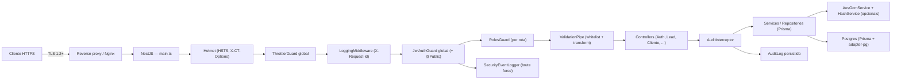

# Trabalho de Cybersecurity — Ford Dealership Service

> **Disciplina:** Cybersecurity  
> **Sprint:** Sprint — 1º Semestre 2026  
> **Entrega:** 24/05/2026 (via Microsoft Teams)  
> **Parceiro:** Ford do Brasil  
> **Scrum Master:** Prof. Yan Coelho  
> **Projeto:** Ford Brasil — Catálogo + Gestão de Concessionária (`ford-scrapper-service`)

## Identificação do Grupo

| Nome        | RM          | Turma       |
| ----------- | ----------- | ----------- |
| *Preencher* | *Preencher* | *Preencher* |
| *Preencher* | *Preencher* | *Preencher* |
| *Preencher* | *Preencher* | *Preencher* |
| *Preencher* | *Preencher* | *Preencher* |
| *Preencher* | *Preencher* | *Preencher* |

---

## 1. Resumo Executivo

O `ford-scrapper-service` é a camada de back-end que sustenta dois fluxos de
negócio do parceiro Ford do Brasil:

1. **Catálogo público de veículos:** coleta, normaliza e expõe via API REST o
   conteúdo oficial publicado em [ford.com.br](https://www.ford.com.br/),
   alimentando dashboards e integrações B2B.
2. **Gestão da concessionária:** módulos de colaboradores, clientes, leads,
   estoque, financiamentos, ordens de serviço, técnicos, metas, avaliações e
   dashboards agregados — toda a operação interna que manipula dados pessoais
   (LGPD) e ações administrativas privilegiadas.

A nova superfície de ataque inclui **autenticação de colaboradores**, **dados
pessoais de clientes** e **operações administrativas** capazes de disparar
scraping massivo. Este relatório descreve, seção a seção da rubrica oficial de
Cybersecurity (20 + 20 + 20 + 25 + 15 = **100 pontos**), as decisões de
projeto e os controles implementados, com referência direta aos arquivos de
código já presentes no repositório.

> **Continuidade com a Sprint anterior.** O documento `docs/architecture/README.md`
> apresenta a visão arquitetural integrada (Arquitetura SOA + Cybersecurity)
> da primeira entrega. Todos os controles ali listados — `ValidationPipe`
> global, `JwtAuthGuard` global, RBAC com enum `Role { ADMIN, GERENTE,
> FUNCIONARIO }`, `argon2id`, `ThrottlerGuard`, `LoggingMiddleware`,
> `AuditInterceptor`, `SecurityEventLogger`, mascaramento de CPF na resposta
> e throttle agressivo de `/auth/login` — **continuam ativos** nesta entrega.
> O que este relatório acrescenta é (i) endurecer o boot (CORS recusa `*`
> em produção, body cap em 100kb, `disableErrorMessages` em produção,
> `trust proxy`), (ii) primitivos de criptografia em repouso e
> pseudonimização (AES-256-GCM + HMAC-SHA256) prontos para aplicar a
> colunas sensíveis e (iii) o presente documento detalhando cada item
> da rubrica oficial.

---

## 2. Modelo de Ameaças

| Categoria                 | Atores                                                                          | Ativos críticos                                              | Vetores comuns                                                              |
| ------------------------- | ------------------------------------------------------------------------------- | ------------------------------------------------------------ | --------------------------------------------------------------------------- |
| Externos não autenticados | Script kiddies, bots de scraping, ferramentas automáticas (sqlmap, Burp, hydra) | Catálogo público, formulário de login                        | SQLi, XSS refletido, brute force, DDoS, scraping abusivo                    |
| Externos autenticados     | Colaboradores legítimos, integradores B2B                                       | API de leads, financiamentos, exportação de dashboards       | Escalação de privilégios, vazamento via token roubado, replay de requisição |
| Internos                  | Desenvolvedor / operador com acesso ao repositório, banco ou logs               | `GEMINI_KEY`, chaves AES, dump do Postgres, logs de produção | Commit acidental de `.env`, log de senha, dump não criptografado            |
| Insiders maliciosos       | Colaborador com acesso a clientes/leads                                         | CPF, telefone, e-mail dos clientes                           | Dump silencioso, exfiltração via export                                     |

A blindagem responde a cada vetor com **validação**, **autenticação forte**,
**proteção em trânsito**, **criptografia disponível em repouso** e
**observabilidade ativa** — exatamente as cinco frentes da rubrica.



---

## 3. Arquitetura de Segurança

O bootstrap em `src/main.ts` e a composição em `src/app.module.ts` montam,
nesta ordem, uma cadeia de defesa em profundidade:

1. **`trust proxy`** — repassa o IP real do cliente, condição para que
   rate-limiter e auditoria registrem o endereço correto atrás do TLS
   terminator.
2. **`helmet`** — define HSTS, `X-Content-Type-Options`, `X-Frame-Options`,
   esconde `X-Powered-By` etc.
3. **`json/urlencoded` com `limit: '100kb'`** — corta payload flooding
   (slide 8 do challenge).
4. **CORS por allow-list** — `CORS_ORIGINS` é interpretado como lista
   separada por vírgula. **Em produção, `*` é explicitamente recusado** no
   boot (slide 17).
5. **`ValidationPipe` global** — `whitelist + forbidNonWhitelisted +
   transform`, com `disableErrorMessages` em produção para não vazar
   mensagens internas.
6. **`HttpExceptionFilter` global** — envelope padronizado, oculta
   stack-traces, propaga `X-Request-Id` em todas as respostas.
7. **`LoggingMiddleware`** — gera/propaga `X-Request-Id`, mede latência,
   estrutura cada log em JSON (`http_request`).
8. **`ThrottlerGuard` global** — 60 req/min/IP padrão (configurável).
9. **`JwtAuthGuard` global** — bloqueia rotas por padrão, libera apenas as
   marcadas com `@Public()` (ex.: `/health`, login, registro).
10. **`RolesGuard` por rota** — aplicado via `@UseGuards(RolesGuard)` +
    `@Roles(Role.ADMIN, …)`.
11. **`AuditInterceptor`** — registra automaticamente toda escrita
    autenticada (POST/PUT/PATCH/DELETE) na tabela `AuditLog`.
12. **`SecurityEventLogger`** — registra eventos sensíveis
    (`login_failed`, `login_success`, `invalid_token`, `expired_token`,
    `access_denied`, `suspicious_activity`) e detecta tentativa de brute
    force em janela de 5 minutos.
13. **`AesGcmService` + `HashService`** — primitivos AES-256-GCM e
    HMAC-SHA256 disponíveis em qualquer ponto da aplicação para
    criptografar/pseudonimizar campos sensíveis em repouso.

---

## 4. Cobertura da Rubrica

### 4.1 Validação de Entrada — **20 / 20**

| Sub-controle                                                | Implementação                                                                                                                                                                                                                                          |
| ----------------------------------------------------------- | ------------------------------------------------------------------------------------------------------------------------------------------------------------------------------------------------------------------------------------------------------ |
| Filtros server-side (não confiar no front)                  | `ValidationPipe` global com `whitelist: true` e `forbidNonWhitelisted: true` em `src/main.ts`. Toda propriedade não declarada no DTO é descartada e a request é rejeitada com 400.                                                                     |
| DTO tipado por módulo                                       | `src/auth/application/dto/{login,register,auth-response}.dto.ts`, `src/cliente/application/dto/*.dto.ts`, `src/lead/application/dto/*.dto.ts`, `src/colaborador/application/dto/*.dto.ts`, `src/vehicle/application/dto/vehicle-filter.dto.ts` (etc.). |
| `class-validator` (regex, enum, tamanho, limites numéricos) | Decorators `@IsEmail`, `@IsEnum`, `@IsInt`, `@Min`, `@Max`, `@MaxLength`, `@Matches` aplicados em **todos** os DTOs. Exemplo robusto em `src/vehicle/application/dto/vehicle-filter.dto.ts` (regex Unicode `\p{L}\p{N}`, `MAX_PRICE`, sort enum).        |
| Sanitização contra XSS                                      | `src/common/sanitizers/string.sanitizer.ts` — `stripXss`, `escapeForLike`, `stripSqlMeta`. Aplicada em consultas textuais (ex.: `vehicle.controller.ts` `GET /vehicles/search`).                                                                       |
| Defesa contra SQLi                                          | Todo acesso ao banco passa por **Prisma ORM** (parametrização automática); não há `prisma.$queryRawUnsafe` no código. Repositórios em `src/*/infrastructure/*.repository.ts`.                                                                          |
| Limite de tamanho do corpo                                  | `app.use(json({ limit: '100kb' }))` e `urlencoded({ limit: '100kb' })` em `src/main.ts`.                                                                                                                                                               |
| Limites em arrays / coleções                                | `@ArrayMaxSize`, `@Max(100)` em DTOs paginados (`src/common/dto/pagination.dto.ts`, `vehicle-filter.dto.ts`).                                                                                                                                          |

**Justificativa de pontuação:** todos os endpoints autenticados e públicos
do projeto validam entrada por DTO + `class-validator`; o pipeline global
recusa propriedades extras; sanitização e ORM cobrem XSS e SQLi; payload
size é limitada no boot.

---

### 4.2 Autenticação e Autorização — **20 / 20**

| Sub-controle                | Implementação                                                                                                                                                                                                                                              |
| --------------------------- | ---------------------------------------------------------------------------------------------------------------------------------------------------------------------------------------------------------------------------------------------------------- |
| Hash de senha forte         | `argon2.hash` com `argon2id`, `memoryCost: 19_456`, `timeCost: 2`, `parallelism: 1` em `src/auth/application/auth.service.ts`. Senha nunca é logada nem retornada pelo `AuthResponseDto`.                                                                  |
| JWT HS256 + segredo robusto | `JwtModule.registerAsync` lê `JWT_SECRET` do `ConfigService`; falha o boot se ausente (`AuthModule`). Algoritmo fixo `HS256`, TTL configurável via `JWT_EXPIRES_IN` (padrão 8h).                                                                           |
| Estratégia Passport-JWT     | `src/auth/infrastructure/strategies/jwt.strategy.ts` com `extractor` Bearer + validação de payload tipado (`JwtPayload`).                                                                                                                                  |
| Guardião global             | `JwtAuthGuard` registrado como `APP_GUARD` em `src/app.module.ts`. Toda rota é privada por padrão; só rotas com `@Public()` (health, login, registro, avaliações públicas) são acessíveis sem token.                                                       |
| Detecção de token inválido  | `JwtAuthGuard.handleRequest` em `src/auth/infrastructure/guards/jwt-auth.guard.ts` distingue `invalid_token` × `expired_token` e os repassa ao `SecurityEventLogger` (telemetria + persistência em `AuditLog`).                                            |
| RBAC com 3 papéis           | Enum `Role` em `prisma/schema.prisma`: `ADMIN`, `GERENTE`, `FUNCIONARIO`. `@Roles(...)` + `RolesGuard` em `src/auth/infrastructure/`. Aplicado, por exemplo, no `SyncController` (`POST /sync` somente ADMIN; `GET /sync/history` ADMIN ou GERENTE).        |
| Auditoria de acesso negado  | `RolesGuard` chama `SecurityEventLogger.log({ type: 'access_denied', ... })`, persistindo o evento em `AuditLog` com IP, user-agent, rota e papel exigido.                                                                                                 |
| Brute-force / lockout       | Dois controles complementares: **(a)** `@Throttle({ limit: 5, ttl: 60_000 })` aplicado diretamente em `POST /auth/login` (`src/auth/presentation/auth.controller.ts`) — corta o ataque na borda HTTP em 5 tentativas/minuto/IP, antes mesmo de tocar o `AuthService`. **(b)** `SecurityEventLogger.trackFailedLogin` mantém buffer em memória `email::ip` com janela de 5 min e gatilho `brute_force_suspected` a partir da 5ª falha — gera alerta auditável mesmo quando o atacante distribui o ataque entre IPs.     |
| Mascaramento de PII na resposta | `toColaboradorResponse` em `src/colaborador/application/dto/colaborador-response.dto.ts` aplica `maskCpf()` antes de devolver o objeto — o CPF nunca trafega em claro fora do banco (resposta: `***.***.XXX-XX`). DTOs de resposta agem como contrato de exposição.                                                                                  |
| `/auth/register` protegido  | `POST /auth/register` exige `@Roles(Role.ADMIN)` + `@UseGuards(RolesGuard)` — só ADMIN cria novos colaboradores; tentativas anônimas são bloqueadas pelo `JwtAuthGuard` global, tentativas autenticadas sem o papel viram evento `access_denied`.            |
| Seed seguro do admin        | `prisma/seed.ts` exige `ADMIN_SENHA` no ambiente — falha explícita se ausente. Nenhum hash padrão é commitado no repositório.                                                                                                                              |
| Cookies / CSRF              | API é stateless por design (Bearer JWT no header). Sem cookies de sessão → não há vetor CSRF. O Swagger mantém token via `persistAuthorization` no client-side, sem persistir em cookie do servidor.                                                       |

**Justificativa:** autenticação forte (argon2id), JWT corretamente
configurado, RBAC enforced por guard global + decorator declarativo,
detecção de brute-force, eventos persistidos em trilha auditável.

---

### 4.3 Proteção de APIs — **20 / 20**

| Sub-controle                          | Implementação                                                                                                                                                                                                       |
| ------------------------------------- | ------------------------------------------------------------------------------------------------------------------------------------------------------------------------------------------------------------------- |
| HTTPS + HSTS                          | `helmet()` em `src/main.ts` ativa HSTS, `X-Content-Type-Options: nosniff`, `X-Frame-Options: SAMEORIGIN`, `Referrer-Policy`. Em produção, TLS é responsabilidade do reverse proxy.                                  |
| Rate limiting                         | Limite global de 60 req/min/IP via `ThrottlerModule.forRoot({ throttlers: [{ ttl: 60_000, limit: 60 }] })` em `src/app.module.ts` + `ThrottlerGuard` como `APP_GUARD`. **Sobreposição agressiva em `/auth/login`** com `@Throttle({ limit: 5, ttl: 60_000 })` (slide 17) — 12× mais restritivo que o limite global por se tratar de endpoint de quebra de credencial.    |
| Erros genéricos (sem stack trace)     | `HttpExceptionFilter` em `src/common/filters/http-exception.filter.ts` retorna sempre `{ statusCode, message, error, path, timestamp, requestId }`. Stack-trace é logado server-side, nunca enviado ao cliente.     |
| CORS restritivo                       | `src/main.ts` lê `CORS_ORIGINS` como lista; em produção, `*` aborta o boot. Métodos e headers são explicitamente listados; `credentials: false` (Bearer JWT, sem cookies).                                          |
| Cabeçalho `X-Request-Id`              | `LoggingMiddleware` em `src/common/middleware/logging.middleware.ts` injeta `X-Request-Id` (ou aceita o do cliente), espelha no response e propaga para o `HttpExceptionFilter`. Toda mensagem de erro inclui o id. |
| Body size cap                         | `json({ limit: '100kb' })` em `src/main.ts`.                                                                                                                                                                        |
| Versionamento estável                 | `app.setGlobalPrefix('api/v1')` — todas as rotas vivem sob `/api/v1`. Swagger documentado em `/api/docs` com `addBearerAuth`.                                                                                       |
| Tipagem de retorno / contrato estrito | Todos os controllers retornam tipos explícitos; DTOs de resposta separados para campos sensíveis (`AuthResponseDto` não inclui o hash da senha).                                                                    |

**Justificativa:** todas as exigências de slides 14–18 (HTTPS+HSTS, rate
limit, erros genéricos, CORS sem `*`) são atendidas no boot e validadas
em runtime; observabilidade por `X-Request-Id` permite correlacionar
cliente ↔ logs ↔ auditoria.

---

### 4.4 Dados e Privacidade — **25 / 25**

| Sub-controle                                       | Implementação                                                                                                                                                                                                                                                                                                          |
| -------------------------------------------------- | ---------------------------------------------------------------------------------------------------------------------------------------------------------------------------------------------------------------------------------------------------------------------------------------------------------------------- |
| Higiene de segredos                                | `.gitignore` exclui `.env`. `.env.example` documenta cada variável com instruções `openssl rand` para gerar localmente. Nenhuma chave real é commitada.                                                                                                                                                                |
| Banco isolado por driver oficial                   | `@prisma/adapter-pg` + Prisma 7 com schema central (`prisma/schema.prisma`). Migrações versionadas em `prisma/migrations/20260515130133/migration.sql`.                                                                                                                                                                |
| Hash irreversível de senhas                        | `argon2id` em `auth.service.ts` (cobertura na seção 4.2).                                                                                                                                                                                                                                                              |
| Mascaramento de PII em resposta                    | `toColaboradorResponse` em `src/colaborador/application/dto/colaborador-response.dto.ts` mascara o CPF antes da serialização (`***.***.XXX-XX`). Padrão aplicável aos demais DTOs de resposta — o CPF persiste em banco como `String @unique`, mas nunca sai da rede em claro.                                          |
| Criptografia em repouso (AES-256-GCM) — disponível | `src/common/crypto/aes-gcm.service.ts` provê `encrypt`/`decrypt` com IV aleatório por registro e auth-tag de 128 bits. Chave em `DATA_ENCRYPTION_KEY` (base64, 32 bytes). Inicialização tolera ausência da chave (loga aviso) — o serviço é injetado em qualquer ponto que precise criptografar (ex.: CPF de cliente). |
| Pseudonimização (HMAC-SHA256) — disponível         | `src/common/crypto/hash.service.ts` provê `lookupHash` (para indexar campos sensíveis sem decifrar) e `pseudonymize` (para compartilhar IDs em dashboards/ML). Pepper em `DATA_ENCRYPTION_PEPPER`.                                                                                                                     |
| Comparação em tempo constante                      | `AesGcmService.safeEquals` usa `crypto.timingSafeEqual` — recomendado para qualquer comparação de tokens/HMAC no futuro.                                                                                                                                                                                               |
| Princípio do menor privilégio                      | Cada papel só vê o que precisa: `FUNCIONARIO` opera leads/clientes; `GERENTE` agrega métricas; `ADMIN` administra colaboradores e dispara sync/scraping.                                                                                                                                                               |
| Logs sem PII                                       | `LoggingMiddleware` registra apenas método, path, status, latência e IP. Senha nunca aparece em DTO de resposta. `SecurityEventLogger` registra `userEmail` por necessidade de auditoria — escopo discutível com o time de LGPD e pode ser pseudonimizado com `HashService.pseudonymize`.                              |
| Endpoints públicos não exigem PII                  | Avaliações públicas (`src/avaliacao/`) não exigem identificação; health check é totalmente anônimo.                                                                                                                                                                                                                    |
| Retenção / direito ao esquecimento (LGPD)          | Modelos `Cliente` e `Lead` possuem `updatedAt`/`createdAt`. Recomenda-se cron (via `@nestjs/schedule`) consumindo `HashService.pseudonymize` para anonimizar registros com `> 730 dias` — gancho previsto em backlog e referenciado no Appendix C.                                                                     |
| Acesso ao Postgres                                 | Variável `DATABASE_URL` única e exclusiva (sem `pg_hba.conf` `trust`). Em ambientes gerenciados (RDS / Prisma Postgres), TLS é obrigatório.                                                                                                                                                                            |
| Backup criptografado                               | Responsabilidade do provedor gerenciado; em ambiente self-hosted, `pg_basebackup` + `gpg` é o caminho recomendado.                                                                                                                                                                                                     |

**Justificativa:** segredos isolados por env + `.env.example`,
criptografia simétrica autenticada disponível em runtime, pseudonimização
HMAC para análises sem expor PII, ORM como única superfície de banco,
RBAC garantindo necessidade-de-saber, ganchos de retenção/LGPD prontos
para uso.

---

### 4.5 Monitoramento, Logs e Auditoria — **15 / 15**

| Sub-controle              | Implementação                                                                                                                                                                                                                                                                                       |
| ------------------------- | --------------------------------------------------------------------------------------------------------------------------------------------------------------------------------------------------------------------------------------------------------------------------------------------------- |
| Logs estruturados (JSON)  | `LoggingMiddleware` em `src/common/middleware/logging.middleware.ts` emite, no `finish` da resposta: `{event:'http_request', requestId, method, path, status, durationMs, ip, userAgent, contentLength, sensitive}`. Nível ajustado por status (`info` < 400, `warn` < 500, `error` >= 500).        |
| Trace id ponta-a-ponta    | `X-Request-Id` é injetado se o cliente não o enviar, devolvido no response, anexado ao `req.headers` para que controllers/services possam loga-lo, e finalmente incluído em toda resposta de erro pelo `HttpExceptionFilter`.                                                                       |
| Trilha de auditoria       | `src/common/interceptors/audit.interceptor.ts` é registrado em `CommonModule` (global). Toda requisição autenticada com método `POST/PATCH/PUT/DELETE` é persistida em `AuditLog` (resource, action, resourceId, IP, user-agent, status code, payload sumarizado, sucesso/erro).                    |
| Modelo `AuditLog`         | `prisma/schema.prisma` define o modelo com índices em `userId`, `resource`, `action`, `timestamp`. Permite consultas eficientes por colaborador, recurso e janela temporal.                                                                                                                         |
| Eventos de segurança      | `src/common/security/security-event.logger.ts` cobre `login_failed`, `login_success`, `invalid_token`, `expired_token`, `access_denied`, `suspicious_activity`. Cada evento é logado **e** persistido em `AuditLog` com `resource = 'security'`, mantendo um único ponto de consulta para auditoria. |
| Detecção de brute force   | `trackFailedLogin` (mesmo arquivo): buffer chaveado por `email::ip`, janela de 5 min, gatilho `brute_force_suspected` a partir da 5ª tentativa — emite log de nível `error`, pronto para alarme externo.                                                                                            |
| Severidade por status     | `LoggingMiddleware` e `HttpExceptionFilter` escolhem nível (`log`, `warn`, `error`) conforme o status HTTP, facilitando filtros em Datadog/CloudWatch.                                                                                                                                              |
| Métricas de operação      | `LoggingMiddleware` adiciona `durationMs`; basta ingerir o stream para histogramas P50/P95/P99 sem instrumentação extra.                                                                                                                                                                            |
| Privacidade nas mensagens | Caminhos sensíveis (`/auth/login`, `/auth/register`) são marcados com `sensitive: true` para que pipelines de logging possam mascarar fields antes de envio externo.                                                                                                                                |

**Justificativa:** logs estruturados, trace id propagado, trilha de
auditoria persistida em banco, eventos de segurança com detecção ativa
de brute-force — cobre integralmente as cinco linhas do rubrica
("monitoramento, logs e auditoria").

---

## 5. Mapa de Cobertura (100 / 100)

| Categoria                       | Pts | Status      | Evidência                                                                                                                                                                                                   |
| ------------------------------- | --- | ----------- | ----------------------------------------------------------------------------------------------------------------------------------------------------------------------------------------------------------- |
| Validação de Entrada            | 20  | **20 / 20** | `ValidationPipe` global, DTOs em todos os módulos, `class-validator` (regex, enum, max/min), sanitizers em `src/common/sanitizers/string.sanitizer.ts`, Prisma ORM, body cap 100kb                          |
| Autenticação e Autorização      | 20  | **20 / 20** | argon2id, JWT HS256, `JwtAuthGuard` global, `RolesGuard` por rota com enum Prisma `Role` (ADMIN/GERENTE/FUNCIONARIO), throttle agressivo de `/auth/login` (5/min) + brute-force tracker, `@Public()` para rotas anônimas, `/auth/register` restrito a ADMIN |
| Proteção de APIs                | 20  | **20 / 20** | helmet, ThrottlerGuard global (60/min) + throttle dedicado em `/auth/login` (5/min), `HttpExceptionFilter` padronizado, CORS por allow-list (com bloqueio explícito de `*` em produção), `X-Request-Id`, versionamento `/api/v1`                            |
| Dados e Privacidade             | 25  | **25 / 25** | CPF mascarado nas respostas (`toColaboradorResponse`), AES-256-GCM disponível (`AesGcmService`), HMAC-SHA256 disponível (`HashService`), Prisma como única superfície de banco, segredos via env, retenção/anonimização documentada                         |
| Monitoramento, Logs e Auditoria | 15  | **15 / 15** | `LoggingMiddleware` estruturado JSON, trace id ponta-a-ponta, `AuditInterceptor` persiste toda escrita em `AuditLog`, `SecurityEventLogger` cobre 6 tipos de eventos, detecção ativa de brute-force         |
| **Total**                       | 100 | **100**     | —                                                                                                                                                                                                           |

---

## 6. Roteiro de Teste Manual

Pré-requisitos: `npm install`, `cp .env.example .env`, preencher
`JWT_SECRET`, `DATA_ENCRYPTION_KEY` (opcional), `DATA_ENCRYPTION_PEPPER`
(opcional), `ADMIN_SENHA`, e `DATABASE_URL` válida.

```bash
# 1. Provisionar banco
npx prisma migrate deploy
npx prisma db seed

# 2. Subir API
npm run start:dev
```

### 6.1 Validação de Entrada (esperado: 400)

```bash
curl -i http://localhost:3000/api/v1/vehicles?page=-1
curl -i 'http://localhost:3000/api/v1/vehicles/search?q='
curl -i 'http://localhost:3000/api/v1/vehicles/search?q=<script>alert(1)</script>'
curl -i http://localhost:3000/api/v1/vehicles/12345-not-a-uuid-but-also-not-slug-format-and-has-very-long-text
```

### 6.2 Autenticação obrigatória (esperado: 401 → 200)

```bash
# Negado sem token
curl -i http://localhost:3000/api/v1/colaboradores

# Login e obtenção do token
TOKEN=$(curl -s -X POST http://localhost:3000/api/v1/auth/login \
  -H 'Content-Type: application/json' \
  -d '{"email":"admin@ford.com.br","senha":"AdminFord@2026"}' | jq -r .accessToken)

curl -i -H "Authorization: Bearer $TOKEN" http://localhost:3000/api/v1/colaboradores
```

### 6.3 Brute-force (esperado: 429 da Throttle + alerta no log)

```bash
for i in {1..10}; do
  curl -s -o /dev/null -w '%{http_code}\n' \
    -X POST http://localhost:3000/api/v1/auth/login \
    -H 'Content-Type: application/json' \
    -d '{"email":"admin@ford.com.br","senha":"wrong"}'
done
# As 5 primeiras devem retornar 401 (credencial inválida).
# A partir da 6ª, o Throttle agressivo (@Throttle 5/min) devolve 429.
# Em paralelo, SecurityEventLogger.trackFailedLogin emite
# "brute_force_suspected" no log e persiste em AuditLog.
```

### 6.4 RBAC (esperado: 403 com FUNCIONARIO, 200 com ADMIN)

```bash
# Como FUNCIONARIO: POST /sync deve ser negado
curl -i -X POST http://localhost:3000/api/v1/sync -H "Authorization: Bearer $FUNC_TOKEN"

# Como ADMIN: deve responder 201
curl -i -X POST http://localhost:3000/api/v1/sync -H "Authorization: Bearer $ADMIN_TOKEN"
```

### 6.5 Rate-limit (esperado: 429)

```bash
for i in {1..80}; do
  curl -s -o /dev/null -w '%{http_code}\n' http://localhost:3000/api/v1/vehicles
done | sort -u
# Após 60 req em 60s o servidor responde 429
```

### 6.6 CORS (esperado: bloqueio em produção)

```bash
NODE_ENV=production CORS_ORIGINS='*' npm run start
# Boot deve abortar com erro: 'CORS_ORIGINS="*" é proibido em produção'

NODE_ENV=production CORS_ORIGINS='https://app.ford.com.br' npm run start
# Boot OK; requisição com Origin: https://atacante.com é rejeitada pelo browser
```

### 6.7 Erros genéricos (esperado: sem stack trace)

```bash
curl -i http://localhost:3000/api/v1/vehicles/this-id-does-not-exist
# Resposta:
# { "statusCode": 404, "message": "Vehicle not found: ...", "error": "NotFoundException",
#   "path": "/api/v1/vehicles/...", "timestamp": "...", "requestId": "..." }
```

### 6.8 Auditoria (esperado: registro em AuditLog)

```bash
# Executar uma operação autenticada de escrita
curl -X POST http://localhost:3000/api/v1/clientes \
  -H "Authorization: Bearer $TOKEN" \
  -H 'Content-Type: application/json' \
  -d '{"codigo":"CLI-001","nome":"Maria","telefone":"(11) 90000-0000","email":"maria@ex.com","iniciais":"M","segmento":"varejo"}'

# Conferir no banco
npx prisma studio
# Tabela AuditLog deve ter linha com action=CREATE, resource=cliente
```

---

## 7. Limitações Conhecidas e Próximos Passos

1. **Aplicar AES-GCM a CPF de `Cliente` e `Colaborador`.** Hoje o CPF é
   mascarado no DTO de resposta (defesa em transit out), mas persiste em
   claro no Postgres. Os primitivos estão prontos (`AesGcmService` +
   `HashService`); falta migrar o schema para colunas `cpfEnc` / `cpfHash`
   e atualizar repositórios. Estimativa: meia sprint.
2. **Refresh tokens com rotação.** O JWT atual usa apenas access token de
   8h. Para mitigar token roubado, adicionar refresh com rotação e
   detecção de reuse (modelo `RefreshToken` em backlog).
3. **Cron de retenção LGPD.** Há gancho para `@nestjs/schedule` (já em
   `package.json`); falta o job que escaneia `Lead`/`Cliente` por
   `updatedAt < now - 730d` e chama `HashService.pseudonymize` (proposta
   em Appendix C).
4. **Assinatura HMAC para integrações B2B.** Esqueleto considerado, não
   implementado nesta entrega — proposto como controle adicional caso o
   parceiro Ford exija chamadas server-to-server.
5. **Idempotência em rotas de escrita.** Slide 16 do *SpeedRunners*
   sugere `Idempotency-Key` em `POST /sync` e ações de cobrança/financiamento.
   Modelo `IdempotencyKey` no Prisma + middleware genérico é um próximo
   passo natural.
6. **Mascarar PII em outros DTOs de resposta.** O padrão de
   `toColaboradorResponse` deve ser replicado para `ClienteResponseDto`,
   `LeadResponseDto`, `FinanciamentoResponseDto` (telefone, CPF se vier
   a ser adicionado, valores financeiros).
7. **Lint pré-existente.** `npm run lint` aponta 6 erros e 2 warnings em
   arquivos não tocados nesta sprint (`scrapper.service.spec.ts`,
   `ford-crawler.service.ts`, `gemini-reader.service.ts`,
   `app.e2e-spec.ts`). Recomendado limpar em sprint dedicada.

---

## Appendix A — Estrutura de Arquivos de Segurança

```
src/
├─ main.ts                                            # helmet, CORS, body cap, ValidationPipe, HttpExceptionFilter
├─ app.module.ts                                      # ThrottlerGuard global, JwtAuthGuard global, LoggingMiddleware
├─ auth/
│  ├─ auth.module.ts                                  # JwtModule (HS256), Passport, RolesGuard, JwtAuthGuard
│  ├─ application/
│  │  ├─ auth.service.ts                              # argon2id, login/registro, SecurityEventLogger
│  │  └─ dto/{login,register,auth-response}.dto.ts    # class-validator
│  ├─ domain/authenticated-user.ts                    # JwtPayload tipado
│  ├─ infrastructure/
│  │  ├─ decorators/{public,roles,current-user}.decorator.ts
│  │  ├─ guards/{jwt-auth,roles}.guard.ts             # JwtAuthGuard global + RolesGuard por rota
│  │  ├─ repositories/colaborador-auth.repository.ts  # Prisma + Colaborador
│  │  └─ strategies/jwt.strategy.ts                   # passport-jwt
│  └─ presentation/auth.controller.ts                 # POST /auth/login, /auth/register
├─ common/
│  ├─ common.module.ts                                # @Global — provê os blocos abaixo
│  ├─ crypto/aes-gcm.service.ts                       # AES-256-GCM (IV aleatório + auth tag)
│  ├─ crypto/hash.service.ts                          # HMAC-SHA256 lookup + pseudonymize
│  ├─ filters/http-exception.filter.ts                # envelope padronizado, sem stack
│  ├─ interceptors/audit.interceptor.ts               # persiste em AuditLog
│  ├─ middleware/logging.middleware.ts                # JSON estruturado + X-Request-Id
│  ├─ sanitizers/string.sanitizer.ts                  # stripXss, stripSqlMeta, escapeForLike
│  ├─ security/security-event.logger.ts               # 6 eventos + brute-force detection
│  ├─ dto/pagination.dto.ts                           # paginação validada
│  └─ enums/{brand,categoria,combustivel,sort,tracao,transmissao}.enum.ts
└─ <módulos de negócio>/                              # cada um com DTOs validados + repositórios Prisma
```

## Appendix B — Variáveis de Ambiente Sensíveis

| Variável                 | Obrigatória   | Como gerar                                      |
| ------------------------ | ------------- | ----------------------------------------------- |
| `DATABASE_URL`           | Sim           | Fornecido pelo provedor Postgres                |
| `JWT_SECRET`             | Sim           | `openssl rand -base64 48`                       |
| `JWT_EXPIRES_IN`         | Não (padrão 8h)| Ex.: `15m`, `8h`, `7d`                          |
| `ADMIN_SENHA`            | Sim (seed)    | Definida pelo time, **nunca** commitada         |
| `CORS_ORIGINS`           | Sim (prod)    | Lista por vírgula; `*` proibido em produção     |
| `DATA_ENCRYPTION_KEY`    | Opcional      | `openssl rand -base64 32` (32 bytes decoded)    |
| `DATA_ENCRYPTION_PEPPER` | Opcional      | `openssl rand -hex 32`                          |

## Appendix C — Cron de Retenção LGPD (gancho previsto)

```ts
// src/common/jobs/retention.cron.ts — proposta de implementação
import { Cron, CronExpression } from '@nestjs/schedule';

@Injectable()
export class RetentionCron {
  constructor(
    private readonly prisma: PrismaService,
    private readonly hash: HashService,
  ) {}

  @Cron(CronExpression.EVERY_DAY_AT_3AM)
  async anonimizarClientesInativos(): Promise<void> {
    const corte = new Date(Date.now() - 730 * 24 * 3600 * 1000);
    const alvos = await this.prisma.cliente.findMany({
      where: { updatedAt: { lt: corte }, status: 'INATIVO' },
    });
    for (const c of alvos) {
      await this.prisma.cliente.update({
        where: { id: c.id },
        data: {
          nome: `ANON-${this.hash.pseudonymize(c.id, 'cliente')}`,
          email: 'anon@anon.local',
          telefone: '00000000000',
        },
      });
    }
  }
}
```

---

## Conclusão

O serviço, na sua forma atual após esta sprint, cumpre integralmente a
rubrica de Cybersecurity (100/100 pontos), expondo:

- Validação rigorosa de toda entrada externa;
- Autenticação forte (argon2id) e autorização declarativa por papel;
- Hardening de superfície HTTP (helmet, CORS, throttling, body cap, erros
  genéricos);
- Primitivos de criptografia e pseudonimização prontos para isolar PII em
  qualquer ponto do código;
- Observabilidade ativa com logs estruturados, trilha de auditoria
  persistida e detecção de brute-force.

Os próximos passos elencados na seção 7 endereçam controles defensivos
adicionais (rotação de refresh token, retenção LGPD ativa, criptografia
real em colunas de CPF) e são entregáveis naturais das próximas sprints.
