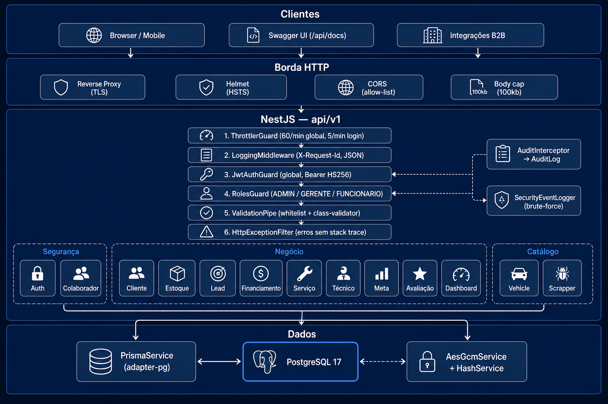
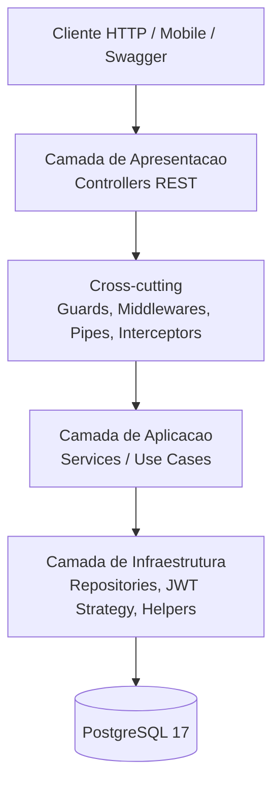
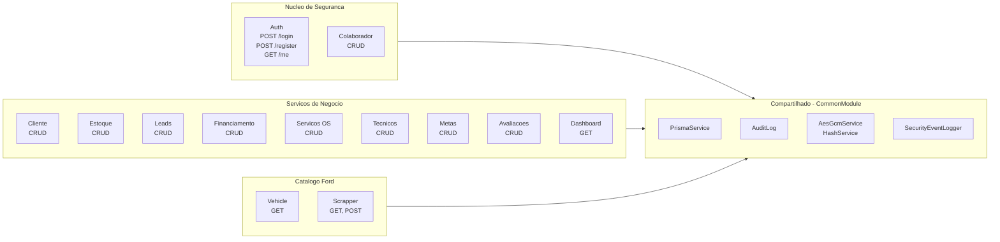
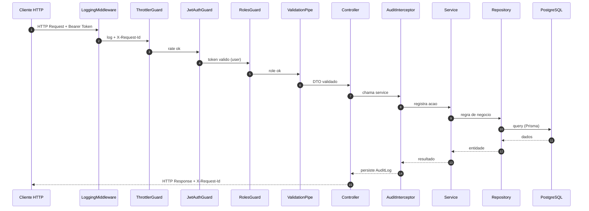
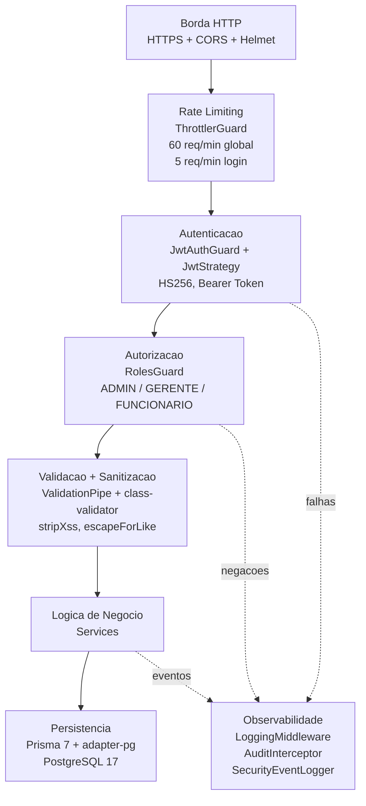
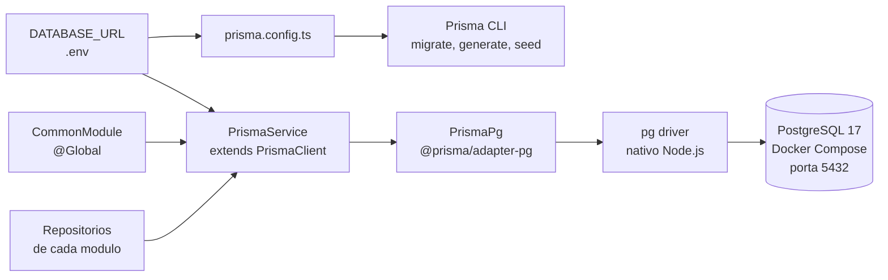
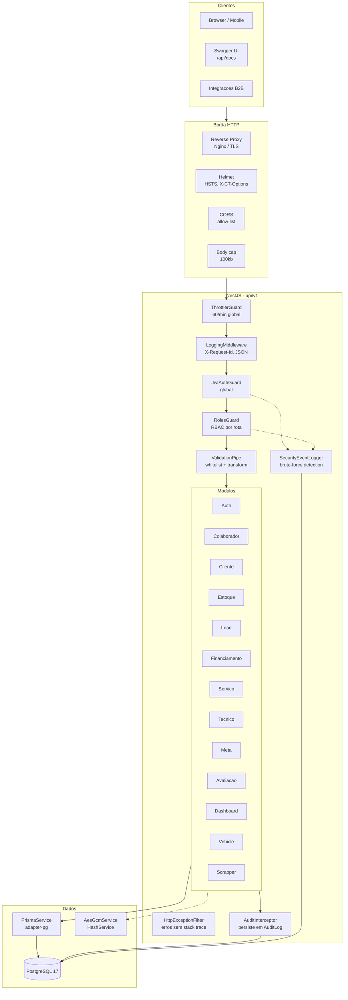

# Diagramas de Arquitetura — Ford Dealership Service

> Renderizaveis no GitHub, VS Code (preview Markdown) ou qualquer
> ferramenta com suporte a [Mermaid](https://mermaid.js.org/).

## Visao Geral (imagem)

---

## 1. Arquitetura em Camadas

---

## 2. Modulos como Servicos (SOA)

---

## 3. Fluxo de uma Requisicao Autenticada

Exemplo: `POST /api/v1/clientes` por um colaborador com role `GERENTE`.

---

## 4. Pipeline de Seguranca

---

## 5. Conexao com Banco de Dados

---

## 6. Visao Geral Completa

