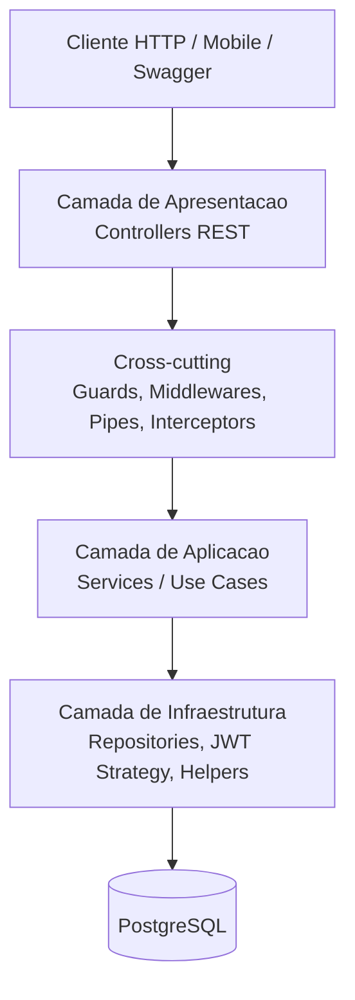
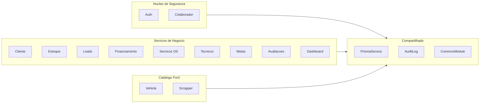
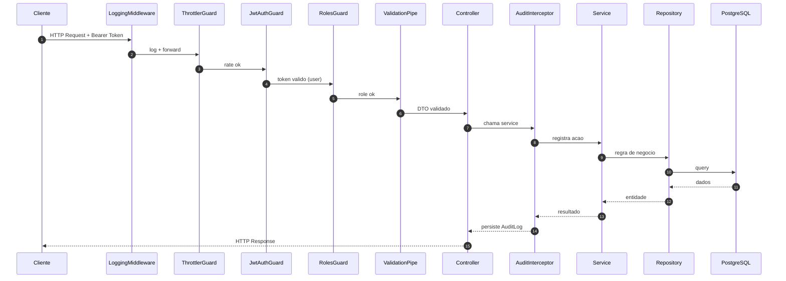
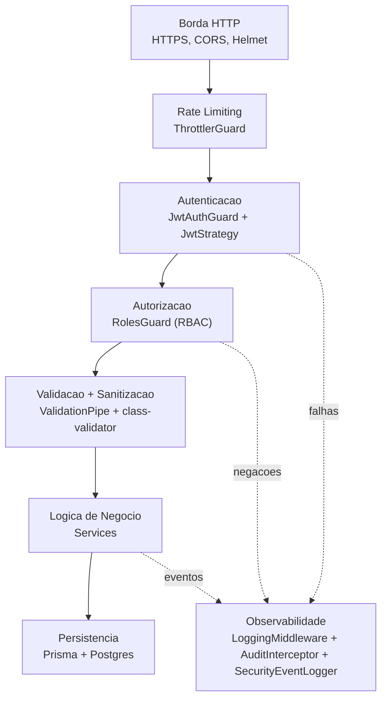

# Arquitetura da Solucao

Este documento apresenta a arquitetura da API Ford Brasil em quatro vistas
complementares, atendendo aos requisitos das sprints de:

- **Arquitetura Orientada a Servicos e Web Services** (desenho de arquitetura,
  organizacao modular, separacao de camadas).
- **Cybersecurity** (defesa em profundidade, autenticacao, autorizacao,
  validacao, observabilidade e auditoria).

> Os diagramas usam [Mermaid](https://mermaid.js.org/). Tanto o GitHub quanto
> o VS Code (preview de Markdown) renderizam-nos nativamente.

---

## Stack

- **Runtime:** Node.js 22, ESM (`"type": "module"`)
- **Framework:** NestJS 11 (controllers, providers, modules, guards,
  interceptors, middlewares, pipes, exception filters)
- **Auth:** `@nestjs/jwt` + `@nestjs/passport` + Passport JWT (Bearer Token)
- **Hash:** `argon2` (Argon2id) para senhas
- **ORM:** Prisma 7 + `@prisma/adapter-pg`
- **Banco:** PostgreSQL 17
- **Validacao:** `class-validator` + `class-transformer` + `ValidationPipe`
  global
- **Seguranca:** `helmet`, `ThrottlerGuard` global, CORS configuravel,
  `HttpExceptionFilter` global, JWT global, RBAC por rota
- **Doc:** Swagger / OpenAPI em `/api/docs`
- **Observabilidade:** logs estruturados (JSON), `LoggingMiddleware`,
  `AuditInterceptor`, `SecurityEventLogger`, tabela `AuditLog`

---

## Vista 1 — Arquitetura em Camadas

Fluxo macro entre as camadas, sem detalhes de cada modulo.



**Princípios:**

1. **Presentation** so conhece **Application** (services).
2. **Application** so depende de **Infrastructure** via abstracoes
   (repositorios injetados).
3. **Infrastructure** isola Prisma/IO; nao vaza para a aplicacao.
4. **Cross-cutting** (guards, pipes, filtros, interceptors, middlewares)
   atua em todas as requisicoes.

---

## Vista 2 — Modulos como Servicos (SOA)

Cada bounded context e um modulo independente e reutilizavel.



| Modulo          | Rota base         | Acesso                                          |
| --------------- | ----------------- | ----------------------------------------------- |
| Auth            | `/auth`           | `POST /login` publico; `POST /register` ADMIN   |
| Colaboradores   | `/colaboradores`  | ADMIN/GERENTE (leitura), ADMIN (escrita)        |
| Clientes        | `/clientes`       | Autenticado (todos os papeis)                   |
| Estoque         | `/estoque`        | Autenticado, escrita ADMIN/GERENTE              |
| Leads           | `/leads`          | Autenticado                                     |
| Financiamentos  | `/financiamentos` | Autenticado                                     |
| Servicos OS     | `/servicos`       | Autenticado                                     |
| Tecnicos        | `/tecnicos`       | Autenticado                                     |
| Metas           | `/metas`          | Autenticado                                     |
| Avaliacoes      | `/avaliacoes`     | **Publico** (GET/POST), update/delete autenticados |
| Dashboard       | `/dashboard`      | Autenticado                                     |
| Vehicles        | `/vehicles`       | Catalogo Ford                                   |
| Sync / Scrapper | `/sync, /scrapper`| Sincronizacao                                   |
| Health          | `/health`         | Publico                                         |

---

## Vista 3 — Fluxo de uma Requisicao Autenticada

Sequencia atravessada por uma requisicao `POST /clientes` por um colaborador
com role `GERENTE`.



Os erros disparam o `HttpExceptionFilter` global, que padroniza a resposta e
loga sem expor stack trace ao cliente.

---

## Vista 4 — Seguranca em Camadas (Cybersecurity)

Mapeamento dos itens da rubrica da sprint de Cybersecurity.



### Aderencia ao edital de Cybersecurity

| Item da rubrica | Implementacao |
| --- | --- |
| Validacao de entradas / sanitizacao | `ValidationPipe` global + DTOs com `class-validator` (`@IsString`, `@IsEmail`, `@Matches` para CPF, `@MaxLength`, `@Min/@Max`). `whitelist: true` + `forbidNonWhitelisted: true` rejeitam payloads desconhecidos |
| Normalizacao de parametros | `class-transformer` (`@Type(() => Number)`, `enableImplicitConversion`) e enums Prisma (`Role`, `ClienteStatus`, `LeadUrgencia`, etc.) |
| Limitacao de tamanho de entrada | `@MaxLength` em todos os DTOs |
| Tratamento seguro de erros | `HttpExceptionFilter` global retorna `{ statusCode, message, error, path, timestamp, requestId }` sem stack trace |
| Autenticacao segura (JWT) | `@nestjs/jwt` + `passport-jwt`, HS256, expiracao configuravel (`JWT_EXPIRES_IN`, default `8h`), secret obrigatorio via env |
| Hash de senha | `argon2id` (memory cost 19MiB, time cost 2) |
| RBAC | Enum `Role { ADMIN, GERENTE, FUNCIONARIO }` + `@Roles()` + `RolesGuard` |
| HTTPS/TLS | Cabe ao reverse proxy (Nginx/Cloudflare/etc) em producao |
| Rate limiting | `ThrottlerModule` + `ThrottlerGuard` global (60 req/min). `/auth/login` com limite agressivo de 5 req/min |
| CORS | `enableCors` com `CORS_ORIGINS` parametrizavel; defaults seguros |
| Helmet | Middleware HTTP de seguranca habilitado globalmente |
| Criptografia em repouso | Senhas com `argon2id`; CPF mascarado em respostas |
| Anonimizacao | `toColaboradorResponse` retorna CPF como `***.***.NNN-NN` |
| Logs sem dados sensiveis | `LoggingMiddleware` evita body de `/auth/*`; logs estruturados em JSON |
| Monitoramento de eventos suspeitos | `SecurityEventLogger` detecta brute-force (>= 5 falhas em 5 min) e dispara `security_alert` |
| Trilha de auditoria | `AuditInterceptor` grava `userId`, `userEmail`, `action`, `resource`, `resourceId`, `ip`, `userAgent`, `timestamp` em `AuditLog` para todo POST/PATCH/PUT/DELETE |

---

## Modelo de Dados (Resumo)

Tabelas adicionadas alem das ja existentes (Vehicle, Motorizacao, Cor,
Imagem, Fontes, SyncRun):

| Tabela            | Proposito                                                |
| ----------------- | -------------------------------------------------------- |
| `Colaborador`     | Funcionario autenticavel (login, RBAC)                    |
| `AuditLog`        | Trilha de auditoria + eventos de seguranca                |
| `Cliente`         | Clientes da concessionaria                                |
| `Avaliacao`       | NPS / feedback de clientes (acesso publico)               |
| `EstoqueVeiculo`  | Veiculos novos/seminovos disponiveis                      |
| `Financiamento`   | Contratos de financiamento                                |
| `Lead`            | Pipeline de leads inteligentes                            |
| `Meta`            | Metas comerciais e KPIs definidos                         |
| `OrdemServico`    | OS da oficina (previstos, andamento, concluidos)          |
| `Tecnico`         | Equipe tecnica da oficina                                 |

Para aplicar:

```bash
npm run prisma:migrate  # cria migration e aplica no DB local
```

Variaveis obrigatorias no `.env` (veja `.env.example`):

- `DATABASE_URL`
- `JWT_SECRET` (>= 32 chars, aleatorio)
- `JWT_EXPIRES_IN` (default `8h`)
- `CORS_ORIGINS` (default `*` em dev; configurar dominios em producao)

---

## Como Testar a Seguranca

1. Subir Postgres e aplicar migrations:
   ```bash
   docker compose up -d
   npm run prisma:migrate
   ```
2. Subir API: `npm run start:dev`
3. **Sem token** → `GET /api/v1/clientes` deve retornar `401`.
4. **Sem token** → `GET /api/v1/avaliacoes` deve retornar `200` (publico).
5. Registrar primeiro ADMIN: como `register` exige ADMIN, criar via seed ou
   diretamente no DB (insert manual com hash argon2).
6. `POST /api/v1/auth/login` → guardar `accessToken`.
7. Usar `Authorization: Bearer <token>` para chamar rotas autenticadas.
8. Tentar `DELETE /api/v1/colaboradores/:id` com role `FUNCIONARIO` → `403` +
   evento `access_denied` no `AuditLog`.
9. Tentar 6 logins invalidos consecutivos → alerta `brute_force_suspected`
   nos logs.
