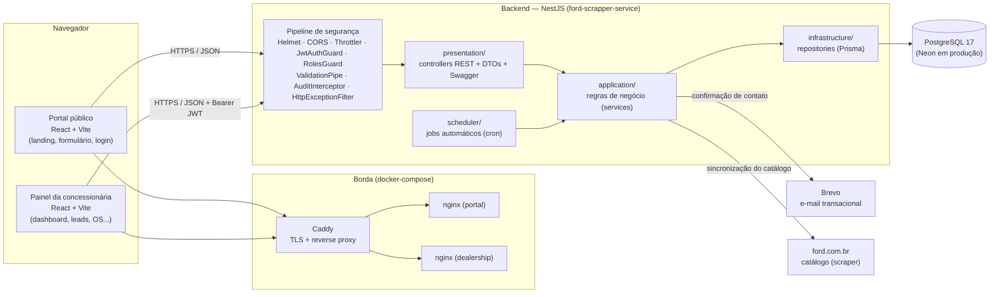
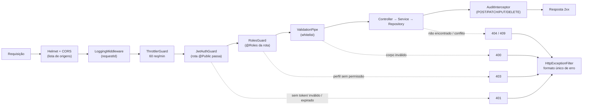
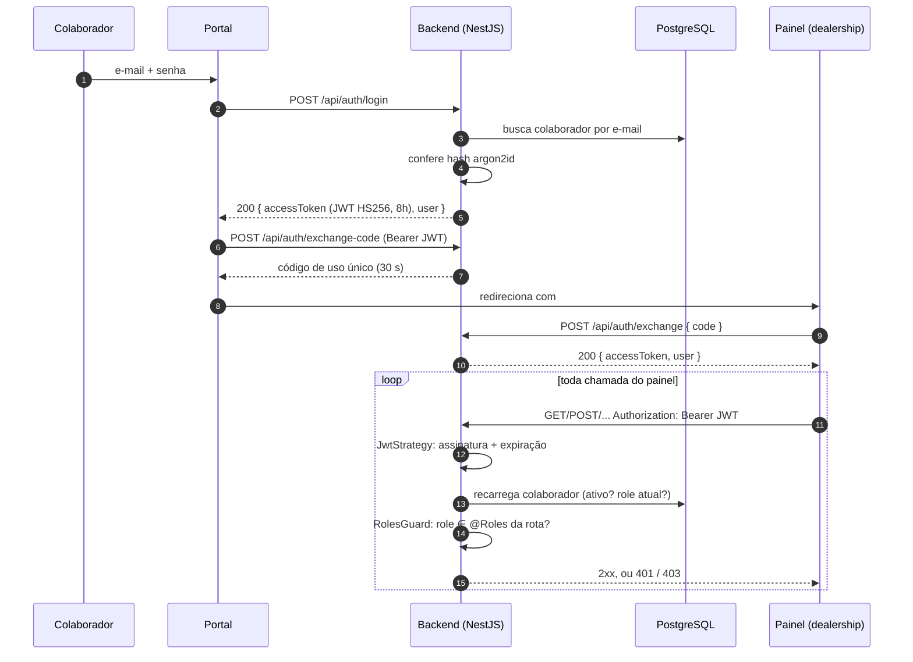

# 01 — Arquitetura da solução

> Critério: **Arquitetura da Solução (20%)** — diagrama de componentes e responsabilidades,
> separação de responsabilidades, fluxo de comunicação e autenticação.

## 1. Diagrama de componentes

## 2. Responsabilidades

| Componente | Responsabilidade | Onde está |
|---|---|---|
| **Portal público** | Captar leads (formulário), mostrar a marca/landing e autenticar o colaborador antes de levá-lo ao painel. Só usa endpoints públicos + login. | repositório `ford-one` (`main/`) |
| **Painel (dealership)** | Uso diário da equipe: leads, clientes, estoque, agenda, ordens de serviço, financiamentos, metas, dashboard. Toda chamada leva `Authorization: Bearer <JWT>`. | repositório `ford-one` (`main/dealership/`) |
| **Caddy + nginx** | Caddy termina TLS e faz proxy reverso; cada nginx serve o SPA compilado (fallback de rotas). | `caddy/Caddyfile` e `docker-compose.yaml` na raiz do workspace |
| **Backend NestJS** | **Único** dono das regras de negócio e do acesso ao banco. Autentica (JWT), autoriza (RBAC), valida entrada, audita escritas, expõe a API REST e a documentação Swagger. | este repositório (`ford-scrapper-service`) |
| **PostgreSQL** | Persistência (Prisma ORM + migrations versionadas). Nenhum frontend fala com o banco. | `prisma/schema.prisma` |
| **Brevo** | Envio do e-mail de confirmação do formulário de contato. | `src/lead/application/public-lead.service.ts` |
| **ford.com.br** | Fonte do catálogo de veículos (scraper com normalização própria). | `src/scrapper/`, `src/vehicle/sync/` |

### Separação de responsabilidades dentro do backend

Cada domínio (`cliente`, `lead`, `servico`, `financiamento`...) é um módulo NestJS isolado, com
as mesmas três camadas, e cada camada só conhece a de baixo:

| Camada | O que faz | O que **não** faz |
|---|---|---|
| `presentation/` | Rotas, verbos HTTP, status codes, DTOs de entrada (`class-validator`), decorators de segurança (`@Roles`, `@Public`) e de documentação (`@Api*`). | Regra de negócio, acesso a banco. |
| `application/` | Regras de negócio e orquestração (ex.: aprovar financiamento converte o lead em cliente numa transação). | Conhecer HTTP (`req`/`res`). |
| `infrastructure/` | Consultas Prisma (repositories). | Regra de negócio. |

Preocupações **transversais** ficam fora dos módulos, em `src/common/` e `src/auth/`: guards, interceptor de
auditoria, filtro global de exceções, logger de eventos de segurança, paginação padronizada.

## 3. Fluxo de comunicação

1. O navegador chama o **Caddy** (TLS), que entrega o SPA pelo nginx correspondente.
2. O SPA chama a API do backend por **HTTPS/JSON** (`/api/...`). Só o backend acessa o banco.
3. Dentro do backend, toda requisição atravessa o pipeline abaixo, **na ordem**:

## 4. Fluxo de autenticação

Detalhes do JWT e da matriz de permissões: [AUTENTICACAO-JWT.md](../AUTENTICACAO-JWT.md).

## 5. Implantação

| Ambiente | Como sobe |
|---|---|
| **Local** | `docker compose up -d` (raiz do projeto): `postgres`, `backend`, `portal`, `dealership`, `caddy`. |
| **Produção** | Backend em Render (Docker, `render.yaml`) com PostgreSQL no Neon; SPAs no Cloudflare Pages; `CORS_ORIGINS` restringe quem pode chamar a API. |

Diagramas complementares do backend (camadas, módulos como serviços, pipeline de segurança, banco):
[`docs/architecture/DIAGRAMS.md`](./DIAGRAMS.md).
